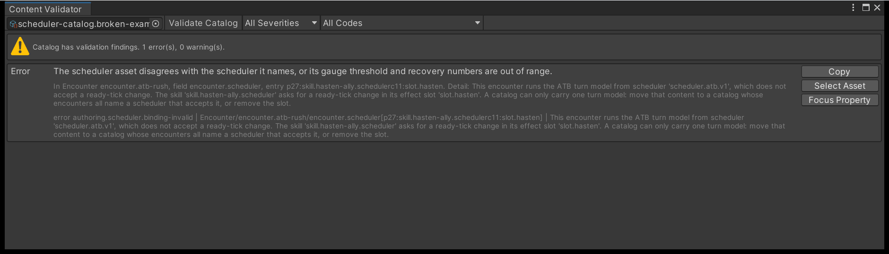

# Schedulers and tempo

After this page you can choose between the two shipped schedulers, set every field on a
scheduler asset, say why swapping one on a running battle is not offered, explain why a
catalog can only carry one turn model, and register a scheduler of your own.

---

## The scheduler asset

A scheduler is a ScriptableObject created from **Assets > Create > TempoForge > Scheduler**,
and every encounter references exactly one. Four fields carry all of its behaviour.

| Field | Applies to | What it sets |
| --- | --- | --- |
| `StateTag` | Both | `ActionOrder` or `Atb`. This field *is* the choice of scheduler |
| `NoActionRecoveryTicks` | Both | Recovery charged when an opportunity produces no action. 1 to 1,000,000 |
| `InputPausePolicy` | ATB only | What the clock does while a player decision is pending |
| `GaugeThresholdUnits` | ATB only | Gauge units a combatant must accumulate to act. 1 to 1,000,000 |

`NoActionRecoveryTicks` is spent whenever a combatant reaches the head of the queue and does
nothing: a stun or other preventing status blocked it, or its AI policy found no legal
command. Without it that combatant would be handed the same opportunity again on the same
tick, so the value must be at least one. The two shipped assets set it identically:

| Field | `scheduler.action-order.v1` | `scheduler.atb.v1` |
| --- | --- | --- |
| `NoActionRecoveryTicks` | 30 | 30 |
| `InputPausePolicy` | unset | `PauseOnInput` |
| `GaugeThresholdUnits` | 0 | 1,000,000 |

!!! warning
    An Action Order asset must carry no input policy and no gauge threshold, and the input
    policy field has to hold zero - which is not one of the policy's named values. Copy the
    shipped `scheduler.action-order.v1` asset rather than creating one from scratch. Every
    rejection is an `authoring.value.invalid` error naming the offending field, such as
    `scheduler.input-policy`, and the Content Validator selects that field for you.

## Action Order

Combatants take discrete turns in rounds. At the start of a round every eligible combatant
becomes a participant; the round ends when all of them have resolved, and a new one begins
immediately. A combatant that dies or whose team concedes mid-round counts as resolved
rather than stalling the round.

Order inside a round is by earliest ready tick, with ties broken by stable ID. After acting,
a combatant's next ready tick is its skill's recovery **divided by its effective speed**: at
speed 1.0 recovery is spent as authored, at speed 2.0 it is halved. Speed therefore shortens
the gap between your turns; it never buys extra turns within a round.

Only one decision is ever outstanding. The scheduler refuses to advance a single tick while
a decision waits, so `AdvanceTicks` returns `AwaitingCommand` and the timeline strip shows
exactly one chip.

## ATB and the gauge

Each combatant carries a gauge that gains its effective speed in units every tick. When the
gauge reaches `GaugeThresholdUnits` the combatant is handed a decision, and the threshold is
*subtracted* rather than the gauge being cleared, so overflow carries into the next fill.

At the shipped threshold of 1,000,000, a combatant at speed 1.0 acts every 100 ticks.
Effective speed may not exceed the threshold: a faster combatant is a
`scheduler.speed.invalid` failure rather than one acting twice in a tick.

After acting, a combatant's gauge stops filling until its recovery ticks have elapsed. Note
the asymmetry with Action Order - here recovery is spent as authored and speed is applied to
the fill instead.

Because several gauges can cross on the same tick, more than one decision can be outstanding
and the timeline strip can show several chips at once. A team member may start part-charged
through `InitialAtbGauge` on the team asset, which must be below the threshold, and must be
zero under Action Order.

## Waiting for a player decision

`InputPausePolicy` decides what the rest of the battle does while a player-controlled
combatant is being asked to choose. It applies to ATB only; Action Order always freezes.

| Policy | While a player decision is pending |
| --- | --- |
| `PauseOnInput` | Nothing moves. The tick stops until you submit |
| `WaitForInput` | Timers keep running, but every other gauge is held one unit below the threshold, so nobody else becomes ready |
| `Active` | Gauges keep filling and other combatants can become ready and queue behind the player |

!!! warning
    Only `PauseOnInput` gives a player a battle they can reproduce. Under the other two the
    tick a command lands on depends on how long the player took to click, so the same
    choices produce a different battle. Recording and replay still reproduce a run exactly,
    because the replay carries each command's requested tick.

An AI-controlled decision never waits on you, whatever the policy: the engine resolves it
from the combatant's AI policy inside the same call.

## Part of encounter identity

The scheduler is authored on the encounter, and the engine binds it once at
`BattleEngine.Create`. No API changes it afterwards, by design. A snapshot carries its
scheduler state, and `Restore` refuses a snapshot whose scheduler ID, contract version,
state tag, ATB threshold or input policy differs from the compiled content it is handed.

The consequence a designer runs into is the next section, and it is the sharpest edge in the
product.

## One catalog, one turn model

The rule in one sentence: **a catalog that speeds anybody up or slows anybody down can only
ever run one turn model, and every encounter in it must name a scheduler of that model.**

Here is why. The `adjust-scheduler` effect is the only effect that moves a combatant's place
in the running order, and the two turn models keep that place in two different places:

| Turn model | Where a combatant's turn lives | The adjustment that moves it |
| --- | --- | --- |
| Action Order | A **ready tick** - the tick it may act on | `ReadyTickDelta` |
| ATB | A **gauge** filling toward a threshold | `GaugeDelta` |

A haste effect authored as "make the ready tick 20 earlier" has nothing to bite on in an ATB
battle: there is no ready tick, only a gauge. The reverse is just as true. There is no
conversion between them, because a conversion would need a speed and a threshold that the
authored effect never carried, and inventing one would make the same content resolve
differently under the two models. So the two are mutually exclusive, and a catalog authored
for one cannot build an engine for the other.

### The compiler reports it, and names both assets

This used to be something you found out mid-battle. It is now a compile error.

When you compile or validate, the compiler sweeps the **whole catalog** - every skill, every
status's periodic effects, and every reaction - for `adjust-scheduler` effects, and checks
each one against the scheduler each encounter names. Any effect the scheduler cannot carry out
is an `authoring.scheduler.binding-invalid` error on that encounter's **Scheduler** field.

The sweep is deliberately catalog-wide rather than roster-wide. The engine asks the same
question of the whole catalog when a battle starts, so a narrower sweep here would let a
catalog compile that no battle could ever start.

The message names both ends of the mismatch and the exact slot:

> This encounter runs the ATB turn model from scheduler 'scheduler.atb.v1', which does not
> accept a ready-tick change. The skill 'skill.haste' asks for a ready-tick change in its
> effect slot 'effect.hasten'. A catalog can only carry one turn model: move that content to
> a catalog whose encounters all name a scheduler that accepts it, or remove the slot.

In the **Content Validator** the finding carries **Select Asset** and **Focus Property**, so
one click takes you to the encounter and the field. The skill, status or reaction at fault is
named in the same line.



### What to do about it

Pick whichever of these matches what you meant:

1. **You want one tempo.** Change the encounter's scheduler asset to one of the family the
   effects were written for, or rewrite the effects for the model the encounter uses. One
   catalog, one model, done.
2. **You want to offer both tempos.** Author two catalogs. Put the Action Order encounters and
   the ready-tick effects in one, the ATB encounters and the gauge effects in the other, and
   pick the catalog when you start the battle. That is exactly what the shipped demo does: a
   starter catalog and a separate ATB catalog, with a scenario picker that spans
   already-compiled variants instead of swapping a preset on a live battle.
3. **The effect was a leftover.** Remove the effect slot. If nothing else in the catalog
   adjusts the scheduler, both models are available to it again.

You can still author two *encounters* on different schedulers inside one catalog - the rule
only bites once a scheduler-adjusting effect exists anywhere in that catalog.

## Registering your own

A custom scheduler reaches a battle through a **`BattleRegistryProvider`** asset. That is the
supported extension point, and it is the only one: TempoForge never scans assemblies for
implementations, and there is no global mutable registry to write into.

1. Write a class that inherits `BattleRegistryProvider` and overrides `ConfigureRegistries`.
   It is a `ScriptableObject`, so give it a `CreateAssetMenu` attribute.
2. Create one asset from it.
3. Assign that asset to the **Registry Provider** field on your **Battle Runtime Controller**,
   and to the **Registry** field in the Battle Workbench toolbar.

```csharp
using TempoForge.Authoring;
using TempoForge.Simulation;
using UnityEngine;

[CreateAssetMenu(menuName = "MyGame/Battle Registries")]
public sealed class MyRegistries : BattleRegistryProvider
{
    protected override void ConfigureRegistries(
        ref BattleSchedulerRegistry schedulerRegistry,
        ref BattleMechanicsRegistry mechanicsRegistry)
    {
        // Registries are immutable values: assign the result back.
        schedulerRegistry = schedulerRegistry.Register(new MyScheduler());
    }
}
```

`CreateRegistries()` builds fresh built-ins on every call and then hands them to your override,
so the built-in schedulers are always there and no mutable registry state is ever shared between
sessions. Assign the **same asset** to the controller and the Workbench: that is what makes the
catalog you balance in the editor the catalog your game runs. A provider that throws is
contained and surfaced as `RegistryProviderFailed` on the controller, and as a status-line
message with no retained compile in the Workbench.

### What a custom scheduler owes the engine

`BattleSchedulerRegistry` is immutable: `Register` returns a new registry, and one scheduler
ID plus contract version may appear only once. A custom scheduler implements
`IBattleScheduler` and must supply a canonical state codec, either by also implementing
`ISchedulerStateCodecProvider` or by passing an `ISchedulerStateCodec` to `Register`. The
codec's ID and contract version must match the scheduler's, and its state tag must still be
`ActionOrder` or `Atb` - there is no third state shape, which is the same rule the previous
section describes from the content side. Add an `ISchedulerAdjustmentAdapter` if your content
adjusts tempo; without one, every `adjust-scheduler` effect in the catalog is refused, and the
error says the scheduler "offers no timing-change adapter at all".

The authored asset's stable ID must equal the registered `SchedulerId` and its
`SchedulerContractVersion` must be `1`. An unknown ID fails as `scheduler.registry.missing`,
and a known ID at another version as `scheduler.version.unsupported`. A catalog may hold up
to 16 scheduler definitions.

Custom implementations remain responsible for determinism, canonical serialization, replay,
forecast and thread isolation. Nothing in the package can check that for you.

If you drive the engine yourself instead of using the controller, compile with the same
registry pair you create the engine with:

```csharp
BattleRegistrySet registries = provider.CreateRegistries();

var compiled = new BattleContentCompiler().Compile(new AuthoringCompileRequest(
    catalog, registries.SchedulerRegistry, registries.MechanicsRegistry));

var encounter = compiled.CatalogSnapshot.Encounters[0].Value;
var engine = BattleEngine.Create(
    compiled.CatalogSnapshot.BattleContent, encounter.StartRequest, seed,
    compiled.CatalogSnapshot.SchedulerRegistry,
    compiled.CatalogSnapshot.MechanicsRegistry);
```

`BattleRegistrySet` keeps the scheduler and mechanics registries together for exactly that
reason: it makes compiling with one pair and starting with another harder to do by accident.

## Next

- **[The engine loop](engine-loop.md)** - what `AdvanceTicks` does with scheduler work.
- **[Combatants, teams and encounters](../how-to/author-combatants-and-encounters.md)** -
  where the scheduler and the starting gauge are assigned.
- **[Step a battle in the Workbench](../how-to/balance-with-the-workbench.md)** - the
  scheduler timeline panel, where ready ticks and gauges are drawn tick by tick.
- **[Determinism](determinism.md)** - the rest of what `PauseOnInput` protects.
