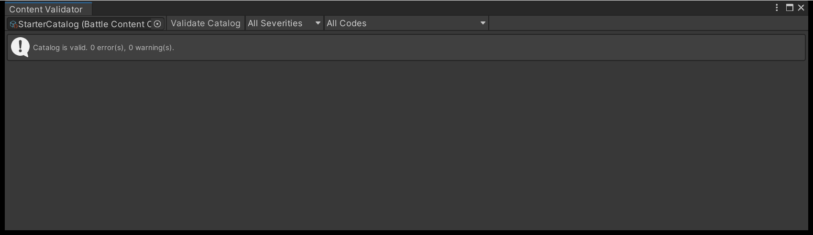

# Author content in the right order

TempoForge content is a set of ScriptableObjects that reference each other, collected in one
catalog and frozen by a compiler. Author the layers bottom-up and every mistake arrives as a
diagnostic naming the asset and the field, instead of as a battle that will not start.
Everything is created from **Assets > Create > TempoForge**, and the starter content in
`Assets/TempoForge/Samples/StarterContent/` is a worked example of every asset type below.

## Stable IDs are contracts

Every asset carries a **stable ID**, assigned when you create it and independent of the
filename and folder. Renaming the asset, moving it, or changing its display label never
changes its identity.

The ID field is read-only in the inspector. Only the explicit **Regenerate Stable ID** action
changes it, and it asks first: the dialog lists every asset that references this one and states
that dependent references are never rewritten for you.

!!! warning "Treat a stable ID like a database column name"
    Changing an ID changes the compiled content, and so the content manifest hash carried on
    every snapshot. A replay recorded against the old content is then rejected on playback
    rather than quietly mis-played. See [Record and replay a battle](record-and-replay.md).

## Build order

Each row references rows above it, so authoring in this order means never pointing a field at
an asset that does not exist yet.

| Order | Create | Because |
| --- | --- | --- |
| 1 | Stat, Resource | Battle Rules name the stats; skill costs and status modifiers name the resources |
| 2 | Effect | one mechanical outcome, naming an implementation and a contract version |
| 3 | Status | modifies stats, restricts skill tags, ticks its periodic effects |
| 4 | Target, Skill | a skill names one target and a list of effect entries |
| 5 | Reaction, AI Policy | a reaction fires effects; a policy chooses among granted skills |
| 6 | Combatant | stat values, resource defaults, granted skills, reactions, a default policy |
| 7 | Formation Preset, Team | where members stand, and whose side they fight for |
| 8 | Battle Rules, Scheduler | the stats and formulas a battle speaks in, and its tempo |
| 9 | Encounter | scheduler, teams, formation and slot assignments: one runnable battle |

One loop exists: a status may carry reactions and a reaction may require a status. Author
whichever you need first, then fill in the other reference.

Field-level detail lives on three pages -- [Effects and statuses](author-effects-and-statuses.md),
[Skills, targets and timing](author-skills-and-targets.md) and [Combatants, teams and
encounters](author-combatants-and-encounters.md). Slots are placed in the
[Formation Editor](place-formations.md); scheduler fields are in [Schedulers and
tempo](../explanation/schedulers.md).

## Collect it in a catalog

A **Battle Content Catalog** is the sole root of the graph the compiler reads. It holds one list
per kind: rules, schedulers, stats, resources, combatants, effects, targets, skills, statuses,
reactions, AI policies, teams, encounters and formation presets.

Compilation never searches your project, `Resources`, Addressables, folders or loaded assemblies.
An asset the catalog does not list does not exist as far as a battle is concerned, and the
compiler says so rather than dropping it:

- A skill referencing an effect the catalog does not list fails with
  `authoring.reference.outside-catalog`.
- A definition the catalog lists but nothing reaches raises the warning
  `authoring.asset.unused` -- how you find content you only thought you had wired up.

One catalog per game is normal. The samples ship two, `StarterCatalog` and `StarterAtbCatalog`;
the demo compiles each on its own and offers the encounters of both.

## Compile it

Compiling freezes a catalog into the snapshot an engine runs from. Nothing is written to disk:
no asset, no subasset, no cache.

```csharp
var result = new BattleContentCompiler().Compile(
    AuthoringCompileRequest.WithBuiltIns(catalog));

for (var i = 0; i < result.Diagnostics.Count; i++)
{
    var d = result.Diagnostics[i];
    Debug.LogWarning(d.Severity + " " + d.DiagnosticId.Value + " | " +
        d.OwnerStableIdRaw + " | " + d.Source.FieldToken.Value + " | " + d.HumanDetail);
}

if (!result.Succeeded) return;   // CatalogSnapshot is null on a failed compile
```

`WithBuiltIns` registers the shipped formulas, effect resolvers, target resolvers, reaction rules
and AI policies, plus the two shipped schedulers. Construct `AuthoringCompileRequest` directly
when you supply your own registries: that form registers nothing for you.

There is no single `Message` string: compose your own line from `DiagnosticId`, `Severity`,
`OwnerStableIdRaw`, `Source` and `HumanDetail`. Diagnostics arrive in a fixed order, so the same
catalog always produces the same list and a test can assert on it.

### What the diagnostics mean

| Diagnostic | Usual cause |
| --- | --- |
| `authoring.id.duplicate` | two assets share an ID, usually after duplicating an asset |
| `authoring.id.empty`, `authoring.id.invalid` | a hand-typed scoped ID -- a formation slot, effect entry, team member -- is blank or malformed |
| `authoring.reference.missing` | a required reference field is empty |
| `authoring.reference.outside-catalog` | the referenced asset is not listed in this catalog |
| `authoring.mechanics.binding-missing`, `authoring.mechanics.version-unsupported` | an effect, target, reaction or policy names an implementation, or a contract version of it, the registry does not have |
| `authoring.collection.limit-exceeded` | an authored collection is over its cap in `AuthoringLimits` |

A reaction chain that can retrigger itself without bound arrives as `authoring.content.invalid`
carrying the nested `reaction.signature.unsafe`; bounded cycles are allowed.

The compiler is fail-closed and stops at the first stage that reported an error, so fixing the
batch you were given can reveal a later one. Repeat until it compiles clean.

## Validate before you run

**Tools > TempoForge > Content Validator**. Assign a catalog and press **Validate Catalog**.

<figure markdown>
  { .shot }
  <figcaption>Validation is read-only &mdash; it never modifies or dirties an asset, and the report is discarded when the window closes or the domain reloads.</figcaption>
</figure>

Filter the report by severity, or by any single diagnostic code present in it. Each row carries
**Copy Diagnostic**, which puts the formatted line on the clipboard, **Select Asset**, which pings
the offending asset in the Project window, and **Focus Property**, which points at the field.

The catalog inspector offers two actions in its footer: **Validate Catalog** opens this window
with the report, and **Compile Snapshot** reports the snapshot and manifest hashes. Validating is
the same compile with the snapshot thrown away, so nothing passes here that a compile rejects.

## Migrate a changed schema

**Tools > TempoForge > Migrate Selected** upgrades the assets you have selected;
**Tools > TempoForge > Migrate Catalog** upgrades the whole catalog closure. Both require exactly
one catalog in the selection, because the closure is what gets validated.

A preview dialog comes first: how many assets are already current, how many have a migration
chain, how many have none, and the per-asset steps. Approving it runs the batch behind a
compiler-backed precommit check on the whole affected closure, so if the migrated content would
not compile, nothing is committed and every asset is restored. The commit is one Undo group,
saving to disk stays explicit, and a migration may never change a stable ID. Schema 1 is the
first public authoring schema and ships no migration step, so these commands matter only once a
later schema version exists.

## Next

- [Effects and statuses](author-effects-and-statuses.md) -- the numbers a battle speaks in.
- [Combatants, teams and encounters](author-combatants-and-encounters.md) -- something runnable.
- [Run a battle from your own code](../tutorials/run-a-battle-from-code.md) -- compile and pump.
