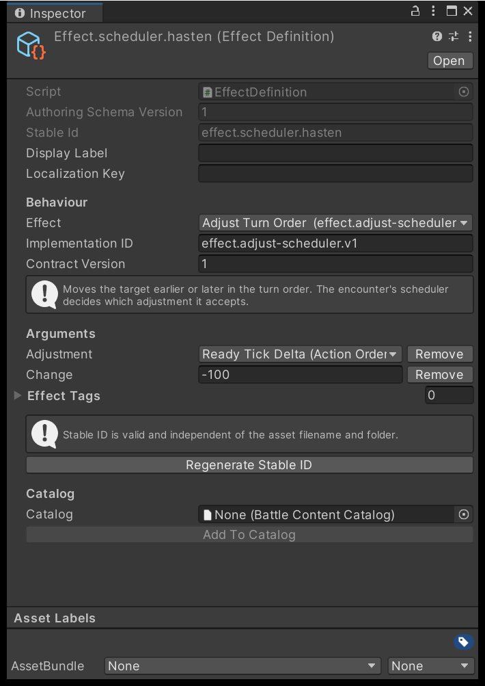

# Effects and statuses

Stats and resources are the numbers a battle speaks in. Effects are what move them, and statuses are
the lasting conditions that modify, restrict and tick. Author these three layers before any skill,
because a skill is a list of effects with timing attached.

## Stats and resources

**Assets > Create > TurnGauge > Stat** defines one named number that formulas read.

| Field | What it does |
| --- | --- |
| `MinimumRaw`, `MaximumRaw` | The range every authored base value for this stat must fall inside. |
| `SemanticTags` | Your own labels. Compiled into the content, never read by the engine. |

That range is a validation range, not a runtime clamp. A combatant whose base value sits outside it
fails to compile; a status modifier may still push the effective value past either end mid-battle.

**Assets > Create > TurnGauge > Resource** defines a spendable pool — energy, focus — in whole
units. Skill costs and `effect.resource.v1` both reference one.

| Field | What it does |
| --- | --- |
| `Minimum`, `Maximum` | The legal range for authored starting values. |
| `MayCrossZero` | Compiled and readable by your own resolvers. The shipped resource effect ignores it. |

Every change is clamped between zero and `Maximum`, and the event carries the requested delta beside
the delta actually applied. A `Minimum` below zero, or a `Maximum` of zero or less, throws at engine
creation rather than at compile.

Keep this set small: your Battle Rules asset names one stat for each of seven roles, and every
combatant needs a positive maximum-health and speed value — see
[Combatants, teams and encounters](author-combatants-and-encounters.md). Fields whose names end in
`Raw` hold scaled integers: a value field uses 10,000 = 1.0, a chance field 1,000,000 = 100%.

## Effects

**Assets > Create > TurnGauge > Effect**. An effect is one mechanical outcome: an implementation
reference, a property set, and `EffectTags` that reactions trigger off. Skills, statuses and reactions
all point at the same effect assets. `AuthoringCompileRequest.WithBuiltIns` registers these ten.

| Implementation ID | What it does | Required properties |
| --- | --- | --- |
| `effect.damage.v1` | Runs a damage formula against the target | `formula-id`, `formula-version` |
| `effect.heal.v1` | Runs a healing formula | `formula-id`, `formula-version` |
| `effect.shield.v1` | Adds a named shield pool | `shield-id`, `amount`, `priority` |
| `effect.resource.v1` | Moves a resource pool by a signed delta | `resource-id`, `delta` |
| `effect.apply-status.v1` | Rolls a chance to apply one status | `status-id`, `chance` |
| `effect.remove-status.v1` | Removes one named status | `status-id` |
| `effect.dispel.v1` | Removes statuses by polarity and tag | `polarity`, `tags`, `maximum-count` |
| `effect.adjust-scheduler.v1` | Shifts the actor's place in the tempo | `adjustment-kind`, `delta` |
| `effect.interrupt.v1` | Cancels a target's interruptible cast | `reason-id` |
| `effect.composite-example.v1` | A worked two-primitive effect | `resource-id`, `delta` |

You do not type any of those IDs. The **Effect** dropdown lists every implementation the
registry knows, with its one-line summary underneath, and choosing one creates that
implementation's required arguments already named and already the right value type. An
argument whose value is an enum is offered as its choices, not as the integer it is stored as.

{ .shot }

### Properties are a closed set

Each `Properties` entry is a key, a value type and one value. Every built-in declares which keys it
accepts, and the compiler holds you to the list: an unaccepted key is `mechanics.property.unknown`, a
missing required key `mechanics.property.missing`, a wrong value type `mechanics.property.tag-invalid`,
an out-of-range value `mechanics.property.range-invalid`. A `status-id`, `resource-id`,
`source-stat-id` or `linked-status-id` naming an asset your catalog lacks fails the same compile.

Damage and healing also accept `potency`, `source-stat-id`, `hit-chance` and `allow-critical`; damage
alone accepts `bypass-defense`, `bypass-shield` and `bypass-incoming-modifiers`. The shield effect
accepts an optional `linked-status-id`: the shield is then removed with that status instance, and does
nothing unless the same action applied the status. `effect.dispel.v1` removes up to `maximum-count`
statuses, oldest first, that are marked `Dispellable` and match `polarity` exactly — `1` neutral, `2`
buff, `3` debuff. An empty `tags` array matches any tag, but the key must still be present.

!!! warning "Scheduler adjustments are family-specific"
    `adjustment-kind` is `1` for a ready-tick delta and `2` for a gauge delta. Action-order accepts
    only the first, ATB only the second, and a mismatch throws when you create the engine rather than
    when you compile. See [Schedulers and tempo](../explanation/schedulers.md).

## Statuses

**Assets > Create > TurnGauge > Status**. A status is a condition carried by one combatant, and it is
how buffs, debuffs, damage over time and loss of control are all expressed. `Polarity` and `Tags` are
what dispels, resistances and immunities match on; `Modifiers` change numbers, `PeriodicEffects` run on
a clock, and `Reactions` are carried only while the status lasts.

A modifier names a Stat asset, a stage and a value. Only the two stat stages read the stat you name.

| `Stage` | What it changes |
| --- | --- |
| `FlatStat`, `MultiplicativeStat` | Adds to, then multiplies, the named stat |
| `Outgoing`, `Incoming` | Multiplies any value the owner produces, or receives |
| `CriticalChance`, `CriticalMultiplier` | Adds to the owner's critical chance; multiplies the rules' critical multiplier |

### Duration and ticking

`DurationAmount` is at least 1, and `DurationClock` says what one unit of it is.

| `DurationClock` | One unit is |
| --- | --- |
| `OwnerActionStart` | One of the owner's actions, spent as it begins |
| `OwnerActionEnd` | One of the owner's actions, spent as it finishes |
| `OwnerOpportunity` | One decision opportunity for the owner |
| `ElapsedTicks` | One tick of battle time |

A status applied during an action does not lose duration to that same action. `PeriodicPhase` chooses
when `PeriodicEffects` fire: `OwnerActionStart`, `OwnerActionEnd`, or `ElapsedBoundary` every
`PeriodicInterval` ticks. That interval must be positive for `ElapsedBoundary` and zero otherwise, and
periodic effects on a status with `PeriodicPhase: None` are a compile error.

Each periodic effect runs **once per stack**, aimed at the owner and sourced from whoever applied it.
Stat modifiers count once per instance whatever the stack count, so a stacking poison scales its
damage while a stacking buff does not.

## Stacking and skill restrictions

`StackPolicy` decides what a second application does. `MaximumStacks` caps it, up to 64.

| `StackPolicy` | Applying it again |
| --- | --- |
| `Refresh` | Resets the duration. `MaximumStacks` must be 1. |
| `AddStacksRefreshAll` | Adds one stack up to the cap and resets the duration |
| `Independent` | Adds a separate instance, up to `MaximumStacks` instances |
| `Replace` | Removes the existing instance, then applies a fresh one |
| `KeepHigher` | Refused while an instance of equal or greater `StrengthRaw` is held |

Statuses sharing an `ExclusiveGroupId` displace one another, and `KeepHigher` compares `StrengthRaw`
across the whole group, so a weaker haste cannot overwrite a stronger one. Set
`RefreshKeepHigherMetadata` if a refused application should still reset the surviving instance's
duration. One combatant may hold 256 instances at once. Four more fields decide what the owner may do:

| Field | Effect on the owner |
| --- | --- |
| `RestrictedSkillTags` | Skills carrying any of these tags are not offered and cannot be submitted |
| `PreventNextOpportunity` | The owner's next decision is skipped |
| `TauntHostileSingleTarget` | Single-target enemy skills are forced onto whoever applied the status |
| `PersistOnDeath` | Whether the instance survives the owner's death |

This is why a stun needs no engine special case: the shipped `status.stun` restricts `tag.offense` and
sets `PreventNextOpportunity`, so the interface stops offering those skills and the turn is lost.

Resistance and immunity are authored on the combatant, not on the status. A resistance reduces the
`chance` the applying effect rolled; an immunity refuses the status outright.

## Next

- **[Skills, targets and timing](author-skills-and-targets.md)** — wrap these effects in something a combatant can use.
- **[Combatants, teams and encounters](author-combatants-and-encounters.md)** — stat values, resistances and immunities.
- **[Step a battle in the Workbench](balance-with-the-workbench.md)** — read the trace that shows each modifier stage in order.
