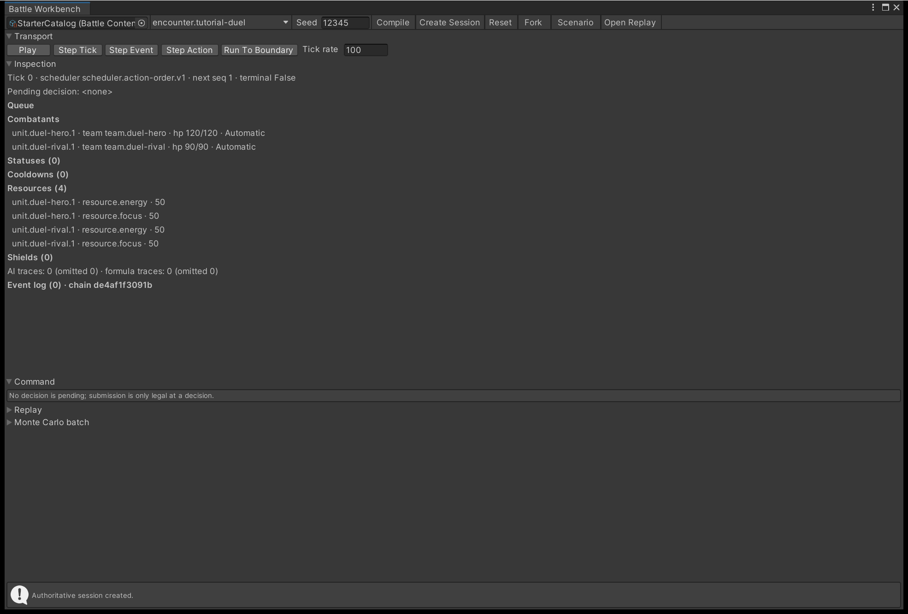

# Step a battle in the Workbench

The Workbench drives one battle in the editor through the same engine calls your game makes, one
tick, event or action at a time. When a number is not the number you expected, this is where you
find the calculation that produced it.

## Open a session

Open **Tools > TempoForge > Battle Workbench** and work along the toolbar from left to right.

{ .shot }

/// caption
**Transport** drives the battle, **Inspection** reports the snapshot at the tick you have reached, and
**Command** offers the legal submissions once a decision is pending.
///

| Control | What it does |
| --- | --- |
| Catalog field | The **Battle Content Catalog** the session is built from |
| Encounter | A dropdown of the compiled encounters — a plain text field for the ID until a compile succeeds |
| **Seed** | The seed the next session is created with |
| **Compile** | Compiles the catalog and keeps the result in window memory |
| **Create Session** | Creates an authoritative session at tick 0; disabled until a compile succeeds |
| **Reset**, **Fork**, **Scenario** | See [Fork, reset and reseed](#fork-reset-and-reseed) |
| **Open Replay** | Opens a captured `.bytes` replay as a replay session |

Nothing recompiles implicitly: changing the catalog or the encounter leaves the retained compile alone
until you press **Compile** again. A failed compile lists its diagnostics with a **Select** button that
pings the asset at fault — the same diagnostics
[Author content in the right order](author-content.md) tells you how to clear.

!!! warning "A script reload closes the session"
    The catalog, encounter and seed are serialized and survive a domain reload; the live session is not,
    and entering play mode pauses it. Press **Compile** and **Create Session** again.

## Step the battle

| Button | Where it stops |
| --- | --- |
| **Play** / **Pause** | Advances **Tick rate** ticks per editor update, pausing itself as soon as the engine reports anything other than `ReachedTarget` |
| **Step Tick** | One tick — the `AdvanceTicks(1)` your own loop calls |
| **Step Event** | The next single event |
| **Step Action** | The end of the current action: `action.completed`, `action.interrupted` or `action.skipped` |
| **Run To Boundary** | Keeps stepping events until the engine stops emitting them |

A boundary is the point the engine will not pass on its own: a pending player decision, a terminal
result, or no scheduled work. Those are the stops your own pump sees, listed in
[The engine loop](../explanation/engine-loop.md#the-five-advance-outcomes). The message strip at the
bottom names the outcome of the last operation, or the diagnostic that refused it. Pressing any step
button pauses playback first, and **Tick rate** is held between 1 and 10,000 ticks per update.

While a decision is pending, **Command** offers one button per legal submission — **Concede**, plus one
per granted skill aimed at the first living enemy. That is the shortest path to *a* legal command, not
a target picker: to choose targets, drive the engine from your own code as
[Take a decision from the player](../tutorials/take-player-input.md) shows.

## Inspect state at a tick

**Inspection** reads the live snapshot on each repaint. Its first line gives the tick, the running
scheduler, the next command sequence and whether the result is terminal; the second names the actor whose
decision is pending.

Below that come the scheduler **Queue** with each entry's control kind, the combatants with team, health
and control kind, then **Statuses**, **Cooldowns**, **Resources** and **Shields**. While a decision is
pending, a targeting block lists the actor's granted skills with the target-lock and invalid-target
policies each carries. The **Event log** prints every event as its sequence, tick and type, headed by
twelve characters of the event chain hash — two runs that diverge differ in that hash from the tick
they parted.

!!! note "The lists are trimmed for display"
    Each heading shows the snapshot's true count, but only the first 16 rows are drawn, and the event
    log shows the last 128 entries. The session retains 65,536 events and 16,384 formula traces, and
    labels the log **truncated** once it has dropped anything older.

## Read a formula trace

Every formula result leaves a trace: one per `damage.resolved`, `healing.resolved` and `effect.missed`
event. Traces sit outside authoritative state and the canonical hash, so reading them cannot perturb the
battle. **Inspection** counts them; the stages are objects you read from the engine's results.

### The stages of one number

`FormulaAttributionTrace.Attribution` holds the chain in `Contributions`, in the order it was applied,
each naming its kind, the ID it came from, and its input and output value. The kinds are `BaseStat`,
`Potency`, `FlatModifier`, `MultiplicativeModifier`, `OutgoingModifier`, `CriticalMultiplier`,
`Defense`, `IncomingModifier`, `Variance`, `Rounding` and `Clamp` — which is how a spike from a critical
multiplier is told apart from a defence contribution that never arrived. `RandomSamples` records each
draw with its exclusive upper bound, so a crit or variance roll is a number you read rather than infer.
The chain ends in `UnclampedResult`, `RoundedResult`, `ClampContribution` and `FinalResult`.

### Pair a number with its trace

Each of those three events carries an `attribution-hash` property; the trace whose `AttributionHash`
matches produced it, and its `Tick`, `RootActionSequence`, `EffectEntryId` and `PrimitiveIndex` place
it exactly.

```csharp
var step = engine.AdvanceTicks(1);
foreach (var trace in step.FormulaAttributions.Traces)
{
    var attribution = trace.Attribution;
    Debug.Log(trace.EventTypeId.Value + " t" + trace.Tick + " = " +
              BattleNumberFormat.Amount(attribution.FinalResult));
    foreach (var stage in attribution.Contributions)
    {
        Debug.Log("  " + stage.Kind + " " + stage.SourceId.Value + " -> " +
                  BattleNumberFormat.Amount(stage.Output));
    }
}
```

Trace values are `Fixed64`, whose `ToString` returns the raw scaled integer, so format them through
`BattleNumberFormat` — see [Determinism](../explanation/determinism.md#never-print-these-types-directly).

!!! warning "The final result is not always the delta"
    `FinalResult` is what the formula produced. The event's `actual-delta` is what the battle
    applied: healing is capped at the target's missing health, and damage meets any shield first,
    with the absorbed part reported on a `shield.changed` or `shield.removed` event instead. A trace
    reading 22 against an event reading 14 is a cap or a shield, not a formula fault.

## Fork, reset and reseed

| Action | What you get |
| --- | --- |
| **Reset** | The same encounter and seed from tick 0, with the session's view logs cleared |
| **Fork** | A preview session cloned at the current tick, carrying the logs so far |
| **Scenario** | A preview session compiled from throwaway in-memory copies of your assets |
| **Seed**, then **Create Session** | A fresh authoritative session on the new seed |

**Reset** keeps the seed the session was created with, so it repeats the battle rather than rerolling it.
Reseeding is the **Seed** field plus another **Create Session**. A fork clones the engine, so the two
histories are independent from that tick on — but the window holds one session at a time, so forking
closes the session you forked from. A forked or scenario session is a **preview**, and replay capture
stays reserved for authoritative sessions, as [Record and replay a battle](record-and-replay.md)
describes.

**Scenario** compiles the catalog asset directly, so it needs no retained compile, only an encounter ID.
It copies the catalog, that encounter and its teams in memory, prunes the copy to the chosen encounter,
and destroys the copies when the session closes; your saved assets are never modified.

## Next

- **[Run Monte Carlo batches](monte-carlo-batches.md)** — batch to find the outlier, then reproduce that
  seed and step it here.
- **[Record and replay a battle](record-and-replay.md)** — the **Replay** foldout's capture, playback and
  divergence reporting.
- **[The engine loop](../explanation/engine-loop.md)** — the outcomes the transport stops on.
