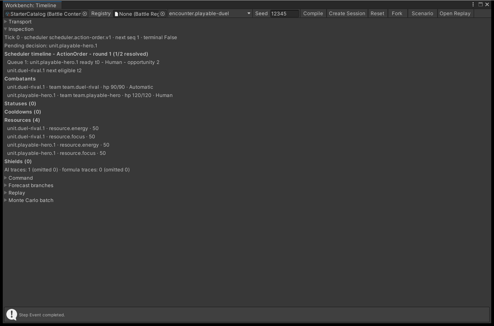
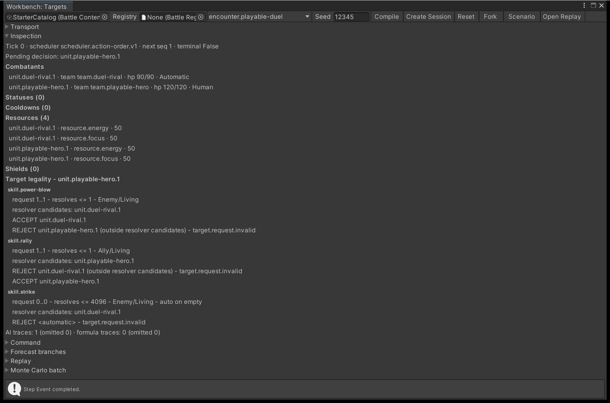
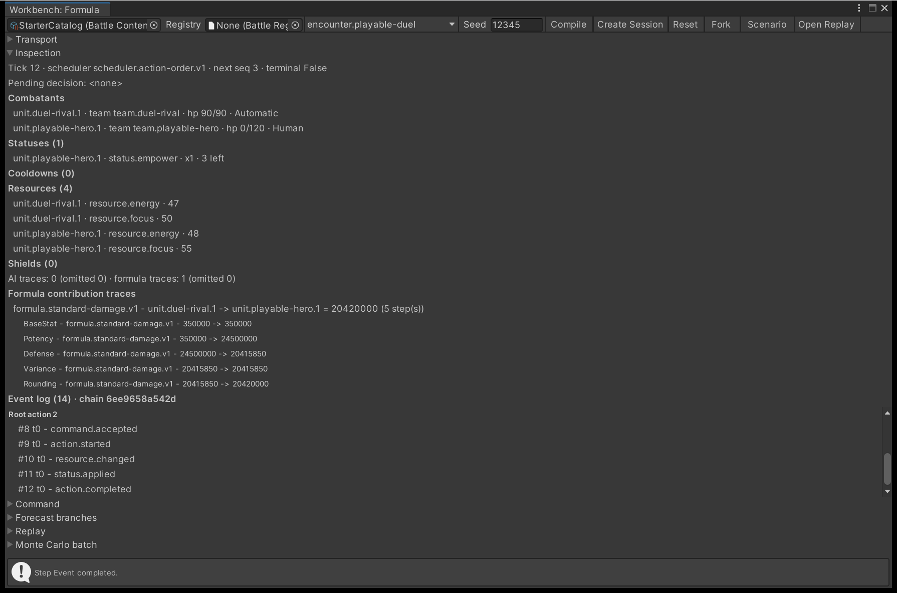
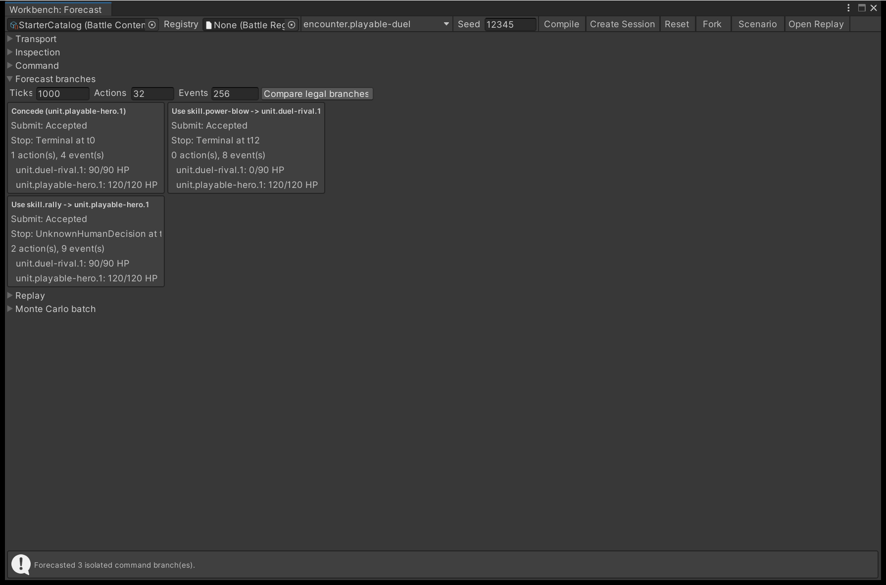

# Step a battle in the Workbench

The Workbench drives one battle in the editor through the same engine calls your game makes, one
tick, event or action at a time. When a number is not the number you expected, this is where you
find the calculation that produced it.

## Open a session

Open **Tools > TempoForge > Battle Workbench** and work along the toolbar from left to right.

{ .shot }

**Transport** drives the battle, **Inspection** reports the snapshot at the tick you have reached, and
**Command** offers the legal submissions once a decision is pending.

| Control | What it does |
| --- | --- |
| Catalog field | The **Battle Content Catalog** the session is built from |
| **Registry** | An optional `BattleRegistryProvider` asset. Leave it empty to compile against the shipped built-ins; assign the one your game assigns to its Battle Runtime Controller to compile and run against your own registrations |
| Encounter | A dropdown of the compiled encounters - a plain text field for the ID until a compile succeeds |
| **Seed** | The seed the next session is created with |
| **Compile** | Compiles the catalog and keeps the result in window memory |
| **Create Session** | Creates an authoritative session at tick 0; disabled until a compile succeeds |
| **Reset**, **Fork**, **Scenario** | See [Fork, reset and reseed](#fork-reset-and-reseed) |
| **Open Replay** | Opens a captured `.bytes` replay as a replay session |

Nothing recompiles implicitly: changing the catalog or the encounter leaves the retained compile alone
until you press **Compile** again. A failed compile lists its diagnostics with a **Select** button that
pings the asset at fault - the same diagnostics
[Author content in the right order](author-content.md) tells you how to clear.

!!! warning "A script reload closes the session"
    The catalog, encounter and seed are serialized and survive a domain reload; the live session is not,
    and entering play mode pauses it. Press **Compile** and **Create Session** again.

## Step the battle

| Button | Where it stops |
| --- | --- |
| **Play** / **Pause** | Advances **Tick rate** ticks per editor update, pausing itself as soon as the engine reports anything other than `ReachedTarget` |
| **Step Tick** | One tick - the `AdvanceTicks(1)` your own loop calls |
| **Step Event** | The next single event |
| **Step Action** | The end of the current action: `action.completed`, `action.interrupted` or `action.skipped` |
| **Run To Boundary** | Keeps stepping events until the engine stops emitting them |

A boundary is the point the engine will not pass on its own: a pending player decision, a terminal
result, or no scheduled work. Those are the stops your own pump sees, listed in
[The engine loop](../explanation/engine-loop.md#the-five-advance-outcomes). The message strip at the
bottom names the outcome of the last operation, or the diagnostic that refused it. Pressing any step
button pauses playback first, and **Tick rate** is held between 1 and 10,000 ticks per update.

While a decision is pending, **Command** offers one button per legal submission - **Concede**, plus one
per granted skill aimed at the first accepted target. That is the shortest path to *a* legal command,
not a target picker: to choose targets, drive the engine from your own code as
[Take a decision from the player](../tutorials/take-player-input.md) shows.

## The four inspection panels

**Inspection** reads the live snapshot on each repaint. Its first line gives the tick, the running
scheduler, the next command sequence and whether the result is terminal; the second names the actor
whose decision is pending. Four panels sit around that header, and each answers a different question.

| Panel | The question it answers |
| --- | --- |
| Scheduler timeline | Who acts next, and how far away is everybody else |
| Target legality | Which of this actor's skills can hit which combatant, right now |
| Formula contribution traces | Where did that number come from |
| Event tree | What actually happened, grouped by the action that caused it |

A fifth panel, **Forecast branches**, is its own foldout further down the window and is covered in
[Compare the legal branches](#compare-the-legal-branches).

### Scheduler timeline

The timeline heading names the turn model and the tempo state that goes with it: for Action Order the
round number and how many participants have resolved, for ATB the input pause policy.

{ .shot }

Under the heading come the lanes.

- **Queue rows** are decisions the scheduler has already handed out. Each names its position in the
  queue, the actor, the tick it became ready, whether that actor is `Human` or `Automatic`, and the
  opportunity sequence. Under Action Order there is only ever one; under ATB several gauges can cross
  on the same tick, so there can be several.
- **Action Order rows** read `next eligible t<tick>`: the tick that combatant may act again.
- **ATB rows** draw a progress bar of gauge units against the threshold, and append
  `locked to t<tick>` while the combatant is still spending its recovery.

The panel prints what the scheduler published and nothing else. It will not estimate a future ready
tick the scheduler has not computed yet, so a combatant with no row is one the scheduler is not
currently tracking.

### Target legality

Every skill the pending actor was granted gets a block, and each block is a verdict rather than a
guess: the Workbench submits each request to an isolated clone of the current engine, so cooldowns,
resource costs, status restrictions, targetability and any resolver you registered yourself all vote.
The live battle is untouched - no RNG is drawn and no command sequence is consumed.

{ .shot }

Read a block top to bottom.

1. The **contract** line: how many target IDs the request must carry, how many targets the resolver
   may return, and the relation and life state it accepts, such as `Enemy/Living`. `auto on empty`
   means the resolver picks for you when you send no IDs at all.
2. The **resolver candidates** line: the combatants this resolver considers, in ID order.
3. One **ACCEPT** or **REJECT** line per request that was probed, with the engine's reason ID on a
   rejection. A request outside the candidate pool is marked `(outside resolver candidates)`, which
   separates "the resolver would never offer this" from "the resolver offered it and the rules said no".

That third distinction is the point of the panel. A skill that looks unusable in play is usually a
`REJECT` with a reason ID naming the cooldown, cost or restriction tag that removed it.

!!! note "Multi-target skills show their contract, not every combination"
    Single-target and automatic requests are probed exhaustively. A skill whose contract needs two or
    more explicit IDs would need a combinatorial picker, so the panel prints the contract and says so
    rather than expanding it. Drive those from the runtime interface or your own code.

### Formula contribution traces and the event tree

Every formula result leaves a trace: one per `damage.resolved`, `healing.resolved` and `effect.missed`
event. Traces sit outside authoritative state and the canonical hash, so reading them cannot perturb
the battle. The panel expands the **last eight** traces into their ordered steps, and the event tree
below it groups every event under the root action that caused it.

{ .shot }

Each trace line names the formula, the source, the target, the final result and the step count. Each
step under it names its kind, the ID it came from, its input and its output, so a spike from a
critical multiplier is told apart from a defence contribution that never arrived.

The event tree is the engine's own causal grouping, not an inference: events carry the root action
sequence they belong to, and reaction events carry a reaction sequence which the tree prints in
brackets. Sequence 0 is drawn as **Battle / scheduler root**, which is where scheduler and battle-level
events live. The heading ends with `chain` and the first twelve characters of the event chain hash -
two runs that diverge differ in that hash from the tick they parted.

!!! note "The lists are trimmed for display"
    Combatants are drawn in full. **Statuses**, **Cooldowns**, **Resources** and **Shields** show their
    true count in the heading and stop after 16 rows. The event tree draws the last 16 root actions and
    the trace panel the last eight traces. The session itself retains 65,536 events and 16,384 traces,
    and labels the log **truncated** once it has dropped anything older. Trimming is display only: it
    never touches the engine, the hashes or a captured replay.

### Compare the legal branches

**Forecast branches** answers "what would each of my options do" without committing to any of them. It
is enabled only at a pending decision. Set the **Ticks**, **Actions** and **Events** caps, press
**Compare legal branches**, and you get up to eight cards, one per legal command shape.

{ .shot }

Each card submits its command to a separate engine clone, then forecasts from the accepted result. It
reports the submit disposition, the stop reason, the tick it stopped on, how many actions and events
it produced, and the resulting health of every combatant. In the capture above, `power-blow` ends the
fight at tick 12 and `rally` does not, which is the comparison you were after.

A branch that reaches another human decision stops with `UnknownHumanDecision`. The tool never invents
the next player command, so this is one decision deep and is not a strategy search. Forecasting leaves
the source snapshot, its hashes, the logs, the command sequence and the RNG exactly as they were; if
you advance the authoritative session afterwards, the panel marks the comparison stale until you press
the button again.

## Pair a number with its trace

Each of the three trace-bearing events carries an `attribution-hash` property; the trace whose
`AttributionHash` matches produced it, and its `Tick`, `RootActionSequence`, `EffectEntryId` and
`PrimitiveIndex` place it exactly.

`FormulaAttributionTrace.Attribution` holds the chain in `Contributions`, in the order it was applied.
The kinds are `BaseStat`, `Potency`, `FlatModifier`, `MultiplicativeModifier`, `OutgoingModifier`,
`CriticalMultiplier`, `Defense`, `IncomingModifier`, `Variance`, `Rounding` and `Clamp`.
`RandomSamples` records each draw with its exclusive upper bound, so a crit or variance roll is a
number you read rather than infer. The chain ends in `UnclampedResult`, `RoundedResult`,
`ClampContribution` and `FinalResult`.

```csharp
var step = engine.AdvanceTicks(1);
foreach (var trace in step.FormulaAttributions.Traces)
{
    var attribution = trace.Attribution;
    Debug.Log(trace.EventTypeId.Value + " t" + trace.Tick + " = " +
              BattleNumberFormat.Amount(attribution.FinalResult));
    foreach (var stage in attribution.Contributions)
    {
        Debug.Log("  " + stage.Kind + " " + stage.SourceId.Value + " -> " +
                  BattleNumberFormat.Amount(stage.Output));
    }
}
```

Trace values are `Fixed64`, whose `ToString` returns the raw scaled integer, so format them through
`BattleNumberFormat` - see [Determinism](../explanation/determinism.md#never-print-these-types-directly).
That is why the trace in the capture above reads `20420000` rather than `20.42`.

!!! warning "The final result is not always the delta"
    `FinalResult` is what the formula produced. The event's `actual-delta` is what the battle
    applied: healing is capped at the target's missing health, and damage meets any shield first,
    with the absorbed part reported on a `shield.changed` or `shield.removed` event instead. A trace
    reading 22 against an event reading 14 is a cap or a shield, not a formula fault.

## Fork, reset and reseed

| Action | What you get |
| --- | --- |
| **Reset** | The same encounter and seed from tick 0, with the session's view logs cleared |
| **Fork** | A preview session cloned at the current tick, carrying the logs so far |
| **Scenario** | A preview session compiled from throwaway in-memory copies of your assets |
| **Seed**, then **Create Session** | A fresh authoritative session on the new seed |

**Reset** keeps the seed the session was created with, so it repeats the battle rather than rerolling it.
Reseeding is the **Seed** field plus another **Create Session**. A fork clones the engine, so the two
histories are independent from that tick on - but the window holds one session at a time, so forking
closes the session you forked from. A forked or scenario session is a **preview**, and replay capture
stays reserved for authoritative sessions, as [Record and replay a battle](record-and-replay.md)
describes.

**Scenario** compiles the catalog asset directly, so it needs no retained compile, only an encounter ID.
It copies the catalog, that encounter and its teams in memory, prunes the copy to the chosen encounter,
and destroys the copies when the session closes; your saved assets are never modified.

## Next

- **[Run Monte Carlo batches](monte-carlo-batches.md)** - batch to find the outlier, then reproduce that
  seed and step it here.
- **[Record and replay a battle](record-and-replay.md)** - the **Replay** foldout's capture, playback and
  divergence reporting.
- **[The engine loop](../explanation/engine-loop.md)** - the outcomes the transport stops on.
