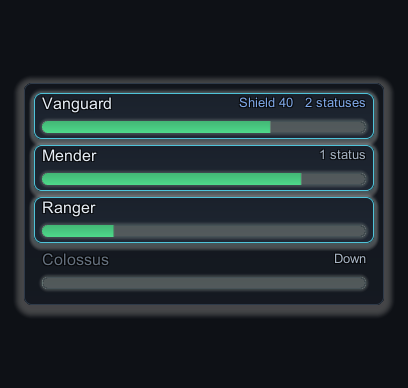
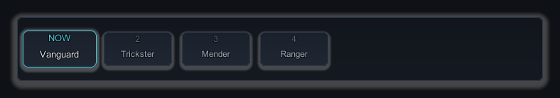
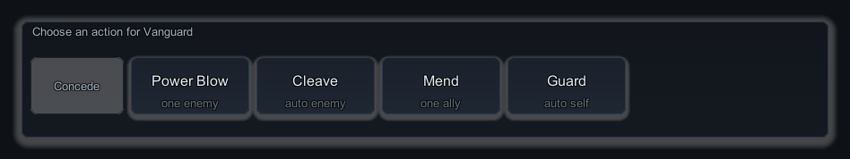
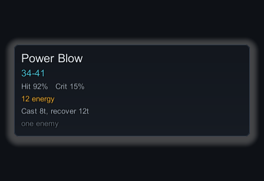
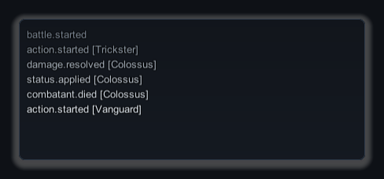
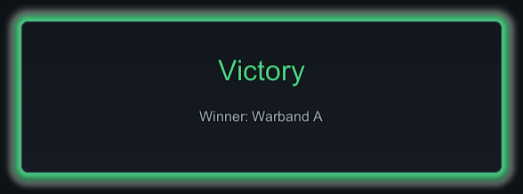
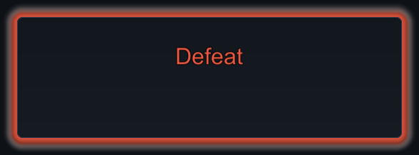

# What each interface region draws

Every region of the battle interface renders values it is handed and calls nothing
back. Read what each one draws, and what it refuses to do, before you decide which
regions to keep. There are no prefabs to open: each region is built from the skin at
runtime, and one whose layout token is not visible is never created at all — see
[Fit the battle to your screen](interface-layout.md) for placing and hiding them. Each
shot below is one region, built by its own public API and nothing else.

## Roster

{ .shot }

One row per combatant: name, a health bar carrying a `health / maximum` readout, and a
caption that folds shield amount and status count onto a single line so the region
stays narrow on a phone. A downed combatant keeps its row, loses its raised plate,
drops its name to the muted role and reads `Down` in its caption — defeated, not
merely faint.

[`StatusRosterView`](../reference/interface-and-widgets.md#statusrosterview) mirrors
the [`UiStatusEntry`](../reference/interface-and-widgets.md#uistatusentry) list it is
given and reads no snapshot. Shield totals and status counts are summed for it before
the rows ever see them, so a row cannot disagree with a snapshot. Rows are pooled and
the region grows to fit them, so a five-combatant party needs no re-authoring and the
height you give this region is overridden by its content.

## Timeline

{ .shot }

Turn order left to right. The acting combatant gets the `PanelRaised` surface, the
accent colour, the `NOW` marker and full size; everyone behind is drawn on the
`Button` surface, numbered from 2, and scaled down slightly so the eye lands on the
actor first even in a still screenshot.

[`TimelineStripView`](../reference/interface-and-widgets.md#timelinestripview)
mirrors the order it is given and never sorts, because ordering is the scheduler's
decision, not the interface's. It draws at most twelve chips
(`TimelineStripView.MaximumChips`) and stops rather than growing off screen. The
strip shows the actors currently ready to decide; it is not a forecast of the whole
battle.

## Skill tray

{ .shot }

A caption naming the pending actor, one button per **legal** command with the target
shape as a sub-caption (`one enemy`, `auto ally`, `3 enemy`), and Concede.
[`SkillTrayView`](../reference/interface-and-widgets.md#skilltrayview) never filters,
validates or submits. It draws the
[`DecisionOptions`](../reference/interface-and-widgets.md#decisionoptions) value it
was given and raises a plain C# event with the choice; a skill that is unaffordable,
restricted or on cooldown is not in that value, so it is not on screen. Concede
appears only when the value says concession is offered. At most twelve skill buttons
are drawn (`SkillTrayView.MaximumButtons`). When the pending decision has no actor —
an AI turn, or no decision at all — the whole tray hides itself.

!!! note "Clicking marks the selection, hovering does not"
    A click applies the `ButtonSelected` surface to that button until the tray is
    next rebuilt or the selection is cleared. Hovering raises the focus event that
    fills the tooltip and leaves the surface alone.

## Tooltip

{ .shot }

Name, damage range, hit chance, crit and status chance, cost, timing, and target
shape. Rows with nothing to say are deactivated rather than blanked, so the panel
shrinks to whatever the skill actually has — and, like the roster, sizes its height
to its rows.

Every figure comes from a
[`TooltipData`](../reference/interface-and-widgets.md#tooltipdata) value your driver
computes from the preview API and hands over.
[`TooltipPanelView`](../reference/interface-and-widgets.md#tooltippanelview) runs no
preview itself, which is what keeps it on the passive side of the presenter contract.
The panel appears when the pointer enters a tray button for which you supplied a
tooltip, and hides when the pointer leaves — supply nothing and hovering shows
nothing. It stays where its layout region puts it and does not follow the pointer.

## Feedback log

{ .shot }

The event stream as text, newest last, older lines fading toward the muted role.
Seven lines are on screen at once (`FeedbackLogView.VisibleLines`) while
`BattleUiRoot.MaximumFeedbackLines` caps retention at 512, so a long battle cannot
grow without bound.
Each line is the event's display name plus the acting combatant in brackets, both
looked up in the display string table you pass in. Anything with no entry there prints
its raw id — a log full of ids means missing display names, not a broken log. See
[Take a decision from the player](../tutorials/take-player-input.md) for filling it.

## Result banner

<figure markdown>
  { .shot }
  <figcaption>Victory takes the <code>Positive</code> role.</figcaption>
</figure>

<figure markdown>
  { .shot }
  <figcaption>Defeat takes <code>Negative</code>. No detail line, so none is drawn.</figcaption>
</figure>

[`ResultBannerView`](../reference/interface-and-widgets.md#resultbannerview) colours
its headline from the result id against the palette — victory `Positive`, defeat
`Negative`, concession `Warning`, a stalled battle `TextMuted`, anything else
`Accent` — and glows the panel in that same colour. A new skin therefore restyles
every outcome without touching a string, and a terminal result you added yourself
still displays instead of throwing.
The detail line is drawn only when the result carries a winning team. The banner fades
in over the skin's panel-fade duration and blocks no raycasts, so it never swallows a
click meant for something underneath.

## Token plates

Above each combatant on the stage, TurnGauge draws a plate:
[`SkinnedTokenPlate`](../reference/interface-and-widgets.md#skinnedtokenplate) stacks
status pips, the name in the team colour, then the health, shield, cast and
scheduler-gauge bars. Three of those bars are conditional, so a plate stays as small
as the state justifies:

- The shield bar appears only while shield remains, scaled against maximum health.
- The cast bar appears only while an action is casting.
- The gauge appears only when your driver supplies one, and brightens to `AccentAlt`
  when it fills — you can see who is next without reading the timeline.

Pips collapse into a final overflow pip once the status count passes
`StatusPips.MaximumVisible` (six in every shipped skin), which stops a heavily-stacked
combatant pushing its plate wider than its token. That overflow pip carries a `+N`
count when `ShowStackCounts` is on. The plate itself lives on a world-space canvas
parented to the token, so it tracks the token with no per-frame screen projection and
is unaffected by the layout regions above.

!!! note "Character art is yours"
    The plate is everything TurnGauge draws over a combatant. It ships no character
    art and invents none — you assign your own sprite to the token's
    `SpriteRenderer`, and the plate reads on top of it. A downed token desaturates
    toward the muted role rather than only dropping alpha.

## Next

- **[Fit the battle to your screen](interface-layout.md)** — place, resize or hide each region.
- **[Palette and surfaces](skin-surfaces.md)** — the colours and shapes they are drawn from.
- **[Bars, gauges and pips](skin-bars-and-pips.md)** — style the bars and pips used above.
