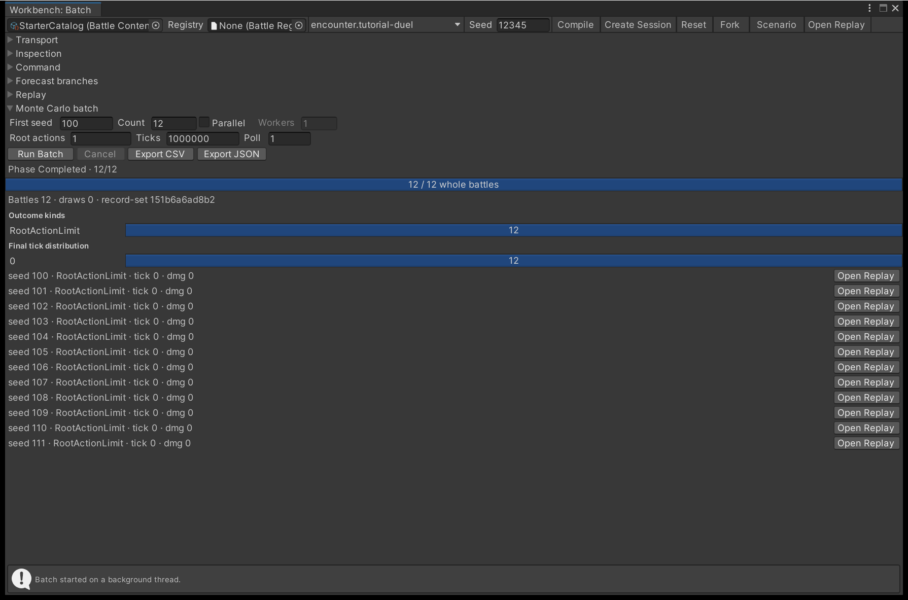
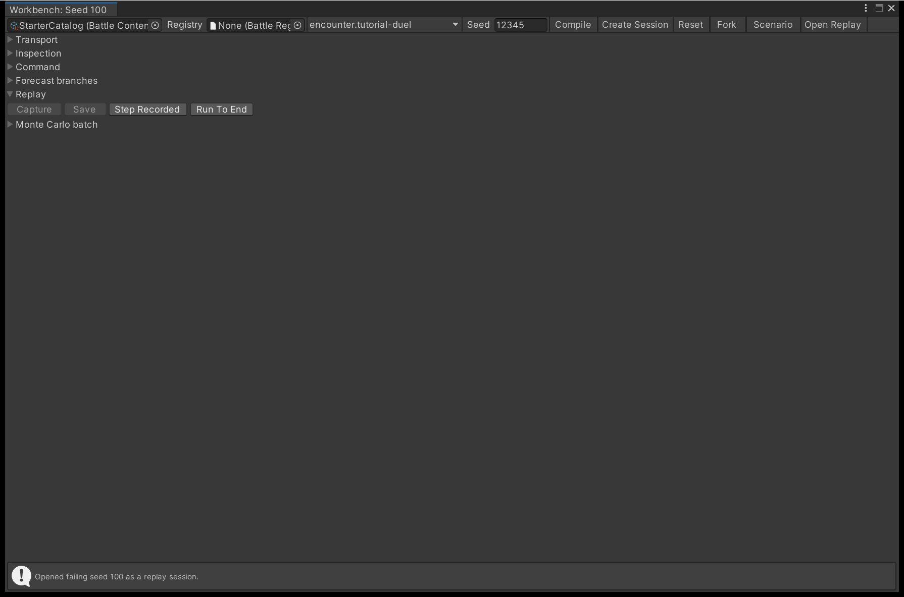

# Run Monte Carlo batches

One battle tells you almost nothing about a matchup. Run the same encounter across a range of seeds,
read the aggregate instead of individual battles, and rerun the single seed that went wrong.

## Run a batch

**Tools > TempoForge > Battle Workbench**, then open the **Monte Carlo batch** foldout at the bottom of
the window. A batch needs a compiled catalog and a selected encounter; without either, **Run Batch**
reports what is missing instead of starting.

{ .shot }

| Field | What it sets |
| --- | --- |
| `First seed`, `Count` | Consecutive seeds from the first. Capped at 65 536 seeds per batch. |
| `Parallel`, `Workers` | Runs whole battles on worker threads. `Workers` must be 1 to 32 - ticking `Parallel` while it reads 0 is refused. |
| `Root actions`, `Ticks` | Per-battle stopping bounds for the runner. Defaults are 10 000 root actions and 1 000 000 ticks. |
| `Poll` | Completed root actions between cancellation checks. Default 64. |

The batch runs on one background thread the window owns, and the window polls it for a phase and a
completed count. The progress bar moves only when a whole battle record has completed, so it counts
finished battles rather than estimating. **Cancel** stops at the next poll and keeps every fully
completed record, but a cancelled batch carries no aggregate. Only one job runs at a time, and the
window cancels and joins that thread on window close, assembly reload and play-mode change.

### Read the charts before the rows

Results open with one aggregate line - battle count, draw count and the first characters of the
record-set hash - then three charts drawn from the immutable records:

| Chart | What it shows |
| --- | --- |
| Outcome kinds | One bar per outcome kind that occurred. Kinds that never happened are absent, not zero |
| Wins by team | One bar per winning team, in team-ID order. Drawn only when some battle was won |
| Final tick distribution | Five buckets across the observed tick range, labelled with their bounds |

The capture above is a deliberate example of a batch that tells you something is wrong: every one of
the twelve seeds landed in `RootActionLimit` at tick 0, because **Root actions** was set to 1. No team
won, so there is no wins chart. See [Stalls are content bugs](#stalls-are-content-bugs) for how to read
that against a real stall.

The charts stay available on a cancelled partial result, since they are derived from records rather
than from the aggregate.

!!! note "Every combatant must be automatic"
    A batch drives AI against AI. A `Human`-controlled combatant anywhere in the encounter's start
    request refuses the whole batch with `analysis.start.requires-automatic`, naming that combatant.

### From code

```csharp
using System.Threading;
using TempoForge.Analysis;

var request = new BattleBatchRequest(
    compiled.BattleContent,
    compiled.Encounters[0].Value.StartRequest,
    compiled.SchedulerRegistry,
    compiled.MechanicsRegistry,
    BatchSeedPlan.FromRange(firstSeed: 1u, count: 500),
    new BattleBatchLimits(),
    CancellationToken.None);

var runner = new BattleBatchRunner();
var result = runner.Run(request);          // or runner.RunParallel(request, workerCount: 8)
```

A malformed request never throws and never starts a battle: both methods return a result whose
`Succeeded` is false, carrying `analysis.request.invalid` and the member at fault, such as
`seed-plan.limit` or `worker-count`. Determinism is what makes `RunParallel` worth using - for one
request the records, the aggregate, the record-set hash and both exports come out byte-identical
whatever the worker count.

## Reproduce an outlier

The batch panel lists the first 64 records. Any record whose kind is not `Terminal` carries an
**Open Replay** button: it reruns that one seed through the identical per-battle algorithm, then opens
the captured replay as a Workbench session, replacing the current one.

{ .shot }

The message strip names the seed it opened, and the session is a replay session, so **Capture** is
refused and free-form commands are refused. From there you use the transport and the four panels in
[Step a battle in the Workbench](balance-with-the-workbench.md#the-four-inspection-panels): step to the
tick that went wrong, then read the formula trace behind the number.

```csharp
SingleBattleReproduction repro = runner.RunSingleForReproduction(request, seed: 90210u);
byte[] bytes = repro.ReplayBytes;          // strict replay envelope, openable in the Workbench
BattleOutcomeRecord record = repro.Record;
```

`SingleBattleReproduction` holds the outcome record and the replay bytes - not an event list and not
traces. The bytes are how you reach those: open them in the Workbench, or play them back yourself.

!!! warning "A rerun that does not match is the interesting failure"
    The Workbench compares the rerun's record against the batch record for that seed. If they differ
    it reports `analysis.reproduction.divergence` and opens nothing, because something outside the
    request changed between the two runs. See [Record and replay a battle](record-and-replay.md).

## Read the aggregate

`result.Aggregate` is a single-threaded ordered reduction over the records sorted by seed. It exists
only on a batch that completed; a cancelled or refused batch leaves it null.

| Field | What it tells you |
| --- | --- |
| `BattleCount` | Records the reduction covers. Every rate you compute divides by this. |
| `TeamWins` | `TeamId` and `Wins` per winning team. A team that never won is absent, not zero. |
| `DrawCount` | Battles ending `battle.draw`: no living, unconceded team left. |
| `StalledCount` | Battles ending `battle.stalled`: both sides still standing at a rules limit. |
| `ConcessionCount` | Battles ending `battle.concession`. |
| `MinimumFinalTick`, `MaximumFinalTick` | The length spread. A wide gap means variance is deciding fights. |
| `TotalFinalTicks` | Divide by `BattleCount` for mean length. |
| `TotalDamageDealt`, `TotalHealingDone` | Summed applied health deltas from `damage.resolved` and `healing.resolved`. A role that contributes nothing shows here. |
| `TotalRootActions` | Completed root actions across the batch. |
| `RootActionLimitCount`, `TickLimitCount`, `CommandLimitCount` | Battles the runner's own bounds stopped. Not terminal results. |
| `NoScheduledWorkCount` | Battles where the scheduler ran out of work to do. |
| `FatalInvariantCount` | Battles that tripped an engine invariant. Treat anything above zero as a bug to report. |
| `RecordSetHash` | The SHA-256 identity of the whole record set. |

`BattleBatchAggregate` itself stops at counts and totals: there is no win-rate percentage on it, and
no distribution. The window's five-bucket tick chart is drawn in the editor from the records, not
stored on the aggregate. For a rate, or for a finer histogram, compute it from the exported records.

There is also no resource-economy chart and no per-formula chart. Batch records do not retain that
data, so anything of that shape has to come from stepping one battle in the
[Workbench](balance-with-the-workbench.md).

## Export the records

`BatchExport.WriteCsv(result)` and `BatchExport.WriteJson(result)` return text. They open no dialog
and write no files - the analysis assembly performs no I/O at all.

The CSV is one header line, one line per record in seed order, then the aggregate as
`# aggregate name=value` comment lines. Each record line carries the seed, kind, result and team IDs,
final tick, completed root actions, event count, damage and healing totals, surviving combatants, and
the final state and event-chain hashes. The JSON carries `formatVersion` 1, `succeeded`,
`wasCancelled`, a `records` array of those same fields, and `aggregate` - an object on a completed
batch, `null` otherwise. Both use invariant culture, `\n` line endings and ASCII, so equal results
export byte-identically across cultures and platforms. The engine diagnostic on a fatal-invariant
record is excluded from both exports and from `RecordSetHash`.

In the window, **Export CSV** and **Export JSON** open a save panel. A path inside the project's
`Assets` folder is refused, so an export cannot become an imported asset by accident.

## Change one thing at a time

1. Author or change content, then clear **Tools > TempoForge > Content Validator** before measuring.
2. Batch a few hundred seeds for each encounter you care about.
3. Read `TeamWins` and the tick spread first. Ignore individual battles.
4. Reproduce the worst outlier, step it, read the traces.
5. Change **one** value. Re-batch the same seed range.

Determinism makes the before and after directly comparable, and that advantage is wasted if you move
three values at once. `RecordSetHash` is the cheap check: identical across two batches of the same seed
range means your change altered none of those battles.

## Stalls are content bugs

`battle.stalled` is a terminal result, not a hang. It means both teams still had a living, unconceded
member when the `MaximumRootActions` or `MaximumBattleTicks` cap on your
[Battle Rules asset](author-combatants-and-encounters.md) was reached. A non-zero `StalledCount` says
some content has no path to resolution: mutual immunity, unpayable costs, or healing that outpaces all
damage.

`RootActionLimitCount` and `TickLimitCount` are a different signal: the runner's own bounds stopped
those battles before the authored rules could end them, so they carry no result at all. Raise the
batch bounds, or lower the rules caps, until stalls show up as stalls.

## Next

- **[Step a battle in the Workbench](balance-with-the-workbench.md)** - the tick-by-tick view and the
  formula trace you reproduce an outlier to reach.
- **[Record and replay a battle](record-and-replay.md)** - what the reproduction bytes are, and how to
  tell content drift from behaviour drift.
- **[Analysis and balancing](../reference/analysis-and-balancing.md)** - every field and method named
  on this page.
