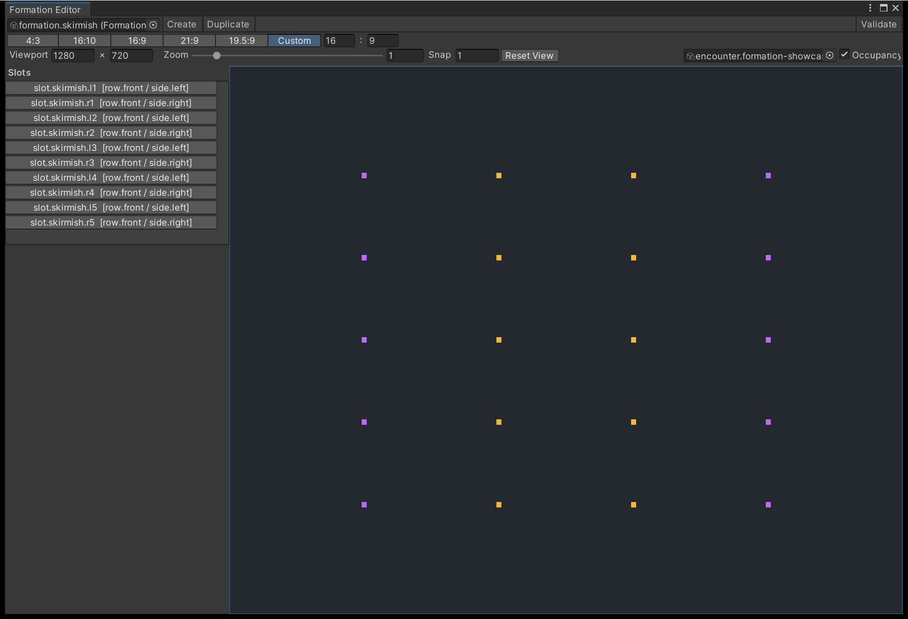
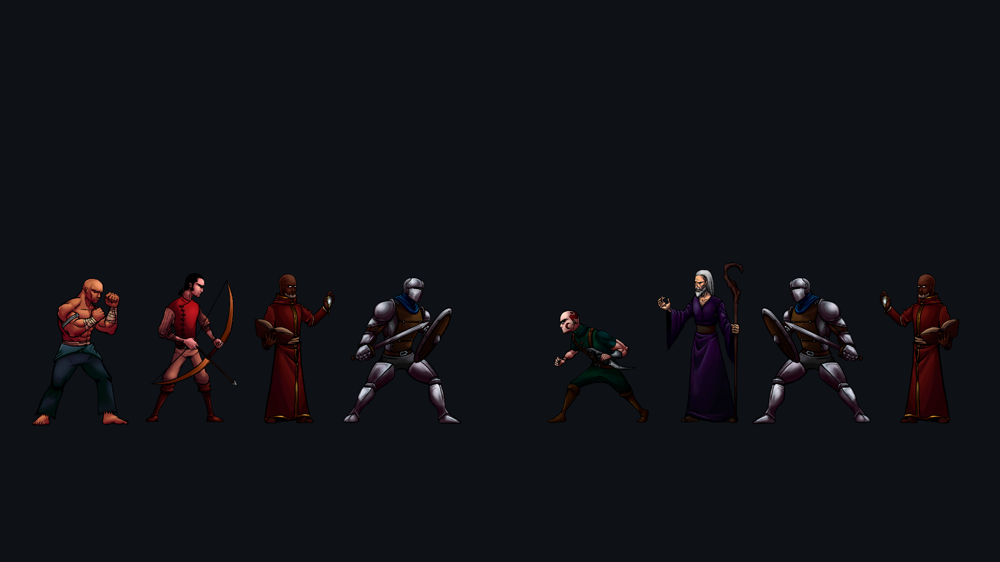
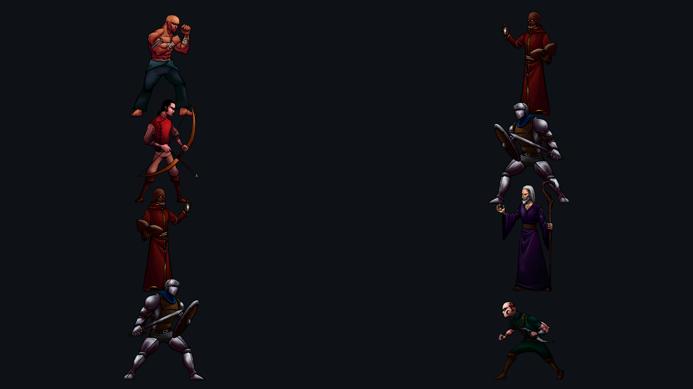
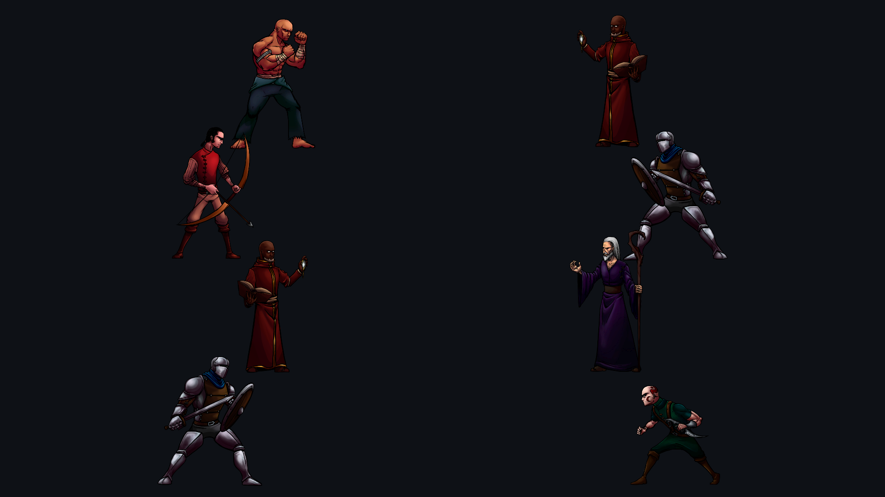
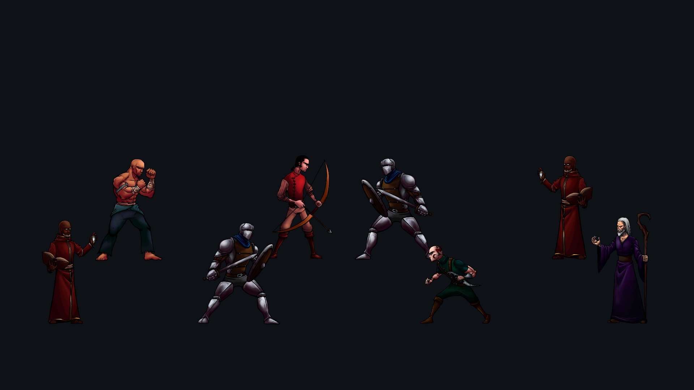

# Place combatants with the Formation Editor

A formation preset holds the slots combatants stand in. You drag those slots against a chosen
aspect ratio, and each slot carries the facing, sorting and effect anchors that presentation
reads back when it draws a token.

---

## Slots are authored in normalized space

Every coordinate on a **Formation Preset** is an integer from **0 to 1,000,000**, with X
increasing to the right and Y increasing upwards from the bottom-left corner. Nothing is
authored in pixels or world units, so one preset serves every resolution. A coordinate outside
that range is a compile error, not a clamp.

Each slot owns three kinds of point:

| Handle | Colour in the preview | What it is |
| --- | --- | --- |
| Slot | Blue | Where the combatant stands |
| Approach | Amber | A second point on the same slot that cues can resolve to |
| VFX anchor | Violet | A named point an effect attaches to, such as a head or a chest |

The preset also carries a **design aspect** — 16:9 unless you change it — and that is the ratio
the runtime fits into your stage. See [How slots reach the screen](#how-slots-reach-the-screen).

## Open the editor

Create a preset from **Assets > Create > TurnGauge > Formation Preset**, then open
**Tools > TurnGauge > Formation Editor** and assign it in the toolbar field. The toolbar's
**Create** and **Duplicate** buttons do the same from inside the window, and **Validate**
recompiles the preset and reports how many diagnostics came back.

{ .shot }

/// caption
The **Slots** list names every slot and the row and side it belongs to. Above it, the aspect
buttons and the viewport fields decide what the preview is measured against.
///

| Control | What it does |
| --- | --- |
| Aspect buttons | Preview the layout at 4:3, 16:10, 16:9, 21:9, 19.5:9, or a custom ratio |
| **Viewport** | The pixel rectangle the normalized points are projected into |
| **Zoom** | Magnifies the preview between 0.1x and 8x; the scroll wheel does the same |
| **Snap** | Grid step in normalized units for a drag; `0` drags freely |
| **Reset View** | Returns pan and zoom to their defaults |

Hold the middle mouse button and drag to pan the preview.

!!! warning "Duplicate keeps the stable ID"
    A duplicated preset intentionally keeps the source's stable ID until you press
    **Regenerate Stable ID** on it. Two assets sharing one ID will not compile.

## Edit a slot

Click a handle in the preview, or a row in the **Slots** list, to select it. Hold ctrl, cmd or
shift to add to or remove from the selection. Dragging then moves everything selected by the
same delta, and the whole drag commits as **one** undo step. Press ++esc++ mid-drag and the
serialized values and the asset's dirty state are both restored.

A drag is clamped so no selected point can leave the legal range: if one handle hits the edge,
the whole selection stops there rather than drifting apart.

The **Selected Slot** panel edits what the slot *is*:

| Field | Effect |
| --- | --- |
| **Slot ID** | The identity an encounter assigns a combatant to |
| **Row ID** | Groups slots into a row for your own layout conventions |
| **Side ID** | Which side of the field this slot belongs to |
| **Facing** | `Left` or `Right`; `Left` mirrors the token's sprite |
| **Sorting Layer Key** | Carried through to the token placement for your own adapters |
| **Sorting Order** | Applied to the token's sprite renderer, so it draws in front or behind |
| **VFX Anchors** | Named anchors, with their coordinates, that effects attach to |

All five ID fields must be valid stable IDs: 1 to 128 characters of lowercase ASCII letters,
digits, `.`, `_` or `-`. None of them may be left empty.

!!! note "Positions are dragged, not typed"
    The panel deliberately omits the slot and approach coordinates — drag them in the preview,
    or type them on the asset's Inspector. Anchor coordinates do appear, inside the
    **VFX Anchors** list. Adding or removing slots, and changing the design aspect, also happen
    on the Inspector; the window edits the slots that already exist.

The authored caps are: 4,096 slots per preset, 16 VFX anchors per slot, sorting order between
-32,768 and 32,767, and aspect components between 1 and 10,000.

## Check occupancy and diagnostics

Assign an **Encounter** in the second toolbar row and tick **Occupancy**. Each slot that the
encounter fills is then labelled in the preview with the combatant instance ID standing in it,
which is how you see an empty back row or a doubled-up slot before you run anything.

Occupancy compiles the encounter's formation, so it holds you to the same rules the compiler
does:

- Exactly two teams, each with both a team and a formation reference.
- Every team member assigned to a slot, and no slot assigned twice.
- All of one team's occupied slots share a single **Side ID**, and the two teams resolve to
  different sides.

Failures appear in the **Diagnostics** list under the slot panel. Clicking one selects the slot
it belongs to and pings the offending asset in the Project window. Two slots sitting on exactly
the same position is reported as a warning rather than an error, since overlapping slots are
sometimes deliberate.

## How slots reach the screen

`BattleStage2D` projects each team's preset with **that preset's own design aspect**, fitted
inside the viewport it was given and centred there; any leftover width or height stays empty.
The aspect buttons in the editor change the preview only — they never change what ships.

For every occupancy the stage spawns one token and takes its placement verbatim: position from
the projected slot point converted to world units, `Facing = Left` flipping the sprite,
**Sorting Order** written to the sprite renderer, and **Sorting Layer Key** carried on the
placement for your own code to read. Anchor and approach points are resolved on demand when a
presentation cue asks for them.

Transforms are outputs here, not inputs. Moving a token in the scene changes nothing
authoritative and is overwritten the next time the stage is built — which is also why a token
in the wrong place is a formation problem, not a scene problem.

To change where the stage itself sits, add **TurnGauge > Battle Stage Frame** next to your
presenter; see [Fit the battle to your screen](interface-layout.md).

## Start from a disposition

You do not have to place every seat by hand. `FormationArrangements.Build` produces a preset for
one of four stage shapes at any count from one to eight a side, which you then ship as-is or open
in the editor and adjust:

```csharp
var preset = FormationArrangements.Build(
    "formation.myparty", FormationArrangement.Rank, 4);
```

### Rank

The horizontal line-up of Darkest Dungeon, Across the Obelisk and LISA. Both parties share one
ground line and face each other.



### Column

The vertical party list of a classic console role-playing game.



### Stagger

A column with every second seat pushed toward the centre, so a wide silhouette still shows an
edge past the one in front of it.



### Perspective

Two parallel rows a side, the back one raised and inset, for sides too crowded for one readable
column.



### The draw order is not the same in all four

This is the part worth understanding before you author your own.

**Rank has no depth to read.** Every seat shares a ground line, so the overlap is settled by
convention instead, and the convention is that the *rear* of the party draws over the front.
That is the opposite of what depth would suggest, and it is deliberate: ordering it the other
way buries the back of the party behind the front rank, and the last team member is the one that
stops being readable.

**The other three have real depth**, running up the screen, so the nearer seat wins. Formation
space puts Y at the bottom of the stage, which means a seat lower on screen is nearer the camera
and must be drawn over the ones behind it. Perspective composes both rules: depth between its
rows, the rank convention within a row.

Getting this backwards costs nothing while combatants are small non-overlapping glyphs, and
becomes obvious the moment real character art overlaps. `FormationDepthOrderTests` checks every
pair of seats on a side, across all four arrangements at all eight counts, and across every
shipped preset.

## Next

- **[Combatants, teams and encounters](author-combatants-and-encounters.md)** — assign
  combatants to the slots you just placed.
- **[Fit the battle to your screen](interface-layout.md)** — the stage rectangle the formation
  is projected into.
- **[Turn events into visuals](presentation-recipes.md)** — what the anchors are for.
