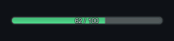
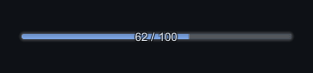
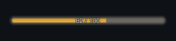
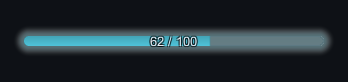
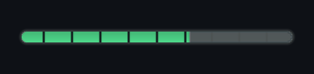

# Bars, gauges and pips

Every bar, gauge and status pip comes from a handful of numbers on the skin. Here is what each
of those changes on screen, and how to build panels of your own from the same primitives.

## The five bar roles

A skin carries five [`SkinBarTokens`](../reference/skinning-and-appearance.md#skinbartokens)
sets — `skin.Bars.Health`, `.Shield`, `.Resource`, `.Cast` and `.SchedulerGauge` — each with its
own `Height`, `CornerRadius`, `Track` surface, `Fill` surface, delta ghost and segment ticks.

| | Role | Draws | Shipped height |
| --- | --- | --- | --- |
| { width="200" } | `Health` | Life remaining, on the token plate and on every roster row | 12 |
| { width="200" } | `Shield` | Shield scaled against maximum health, only while shield remains | 6 |
| { width="200" } | `Cast` | Progress toward an action resolving | 8 |
| { width="200" } | `SchedulerGauge` | How close a combatant is to acting | 10 |
| | `Resource` | Nothing shipped. Previewed in the Skin Browser, and there for a mana or stamina bar you build | 8 |

### Fill colours you author, and fill colours you do not

Height, corner radius, stroke, glow and segments hold as authored on all five. Two fill
**colours** are overwritten at runtime, so change the palette role rather than the bar:

- The health bar **on a token plate** is recoloured from the fraction: `Positive` when
  healthy, through `Warning`, to `Negative` under 30%. A roster row keeps the authored colour,
  because the row already carries the numbers.
- The gauge is tinted `Accent` while filling and `AccentAlt` once full, so a player sees who
  acts next without reading the timeline.

!!! note "The cast bar and the gauge need a driver"
    Nothing in the package supplies those two fractions. Reach a token through
    `BattleStage2D.TryGetToken`, then call `CombatantTokenView.SetCastProgress(fraction,
    visible)` or `SetGauge(fraction, visible)` yourself. Until you do, both bars stay hidden
    and the plate stays short. What a gauge means is covered by
    [Schedulers and tempo](../explanation/schedulers.md).

## Readouts and segments

A bar built with a readout centres a caption across its whole height, in the skin's caption size
and `TextPrimary` colour. The roster row is the only shipped bar with one; it reads
`health / maximum`.

<figure markdown>
  { .shot }
  <figcaption><code>SegmentCount = 10</code> with <code>SegmentColor</code> set to the background &mdash; ten notches, so a player can count what is left instead of estimating it. <code>SegmentCount = 0</code> draws a continuous bar; the cap is 32.</figcaption>
</figure>

Notches cross track and fill alike, so they stay visible on both sides of the value.
`DeltaCatchUpSeconds` controls the trailing ghost that shows the value just lost. It is only
built when that value is above zero, only appears when a bar **falls**, and holds at the old
value before catching up. Set it to 0 to remove that feedback; the shipped cast bar and gauge
already do, because neither loses value in a way a player needs to read.

!!! tip "Readouts over bright fills"
    The readout sits on top of the fill, so a light caption over a saturated colour can lose
    contrast. Turn on `Typography.UseOutline` and set `OutlineColor` to your background, or
    drop the readout and let a caption beside the bar carry the numbers instead.

## Status pips

[`SkinStatusPipTokens`](../reference/skinning-and-appearance.md#skinstatuspiptokens) controls
the strip above a combatant's name.

| Field | Range | What it changes |
| --- | --- | --- |
| `Size` | 4–48 | Pip edge length, and the height of the whole strip |
| `Spacing` | 0–24 | Gap between pips |
| `Surface` | — | Pip shape, corner radius, stroke and glow |
| `MaximumVisible` | 1–24 | Pips drawn before the last one becomes an overflow pip |
| `ShowStackCounts` | — | Draws `+N` on the overflow pip |

Every shipped skin uses 18, 4, six visible pips and counts on. The cap keeps a
heavily-stacked combatant from pushing its plate wider than its token: with six visible and
eight statuses, the sixth pip carries `+3` and stands for itself plus the two not drawn.

!!! warning "Pip fill colour is set at runtime"
    The plate tints every ordinary pip with `Accent` and the overflow pip with
    `SurfaceRaised`, replacing whatever fill colour the pip surface was authored with. To
    change pip colour, change those two palette roles. Shape and glow behave as authored.

## Motion and reduced motion

Every animated duration passes through `MotionScale`, so one field slows the interface down or
snaps it.

| Field | Animates |
| --- | --- |
| `MotionScale` | Multiplier over every duration below. `0` snaps all of them |
| `BarTransitionSeconds`, `BarEasing` | A bar moving to a new value, and the shape of that move |
| `PanelFadeSeconds` | The result banner fading in |
| `PulseSeconds`, `PulseScale` | The token pulse, which always returns to rest |

When a tester reports that motion feels wrong, two fields fix it:

- `MotionScale = 0` makes every transition instant. No bar animates, and no delta ghost
  appears, because a ghost needs a transition to trail.
- `ReduceMotion = true` does the same, and additionally caps a floating number's lifetime at a
  quarter of a second. Wire it to a player accessibility setting.

!!! note "Two authored timings no widget reads yet"
    `PipPopSeconds` and `TimelineShiftSeconds` are stored and clamped like the rest, but no
    shipped widget animates from them. Changing either has no visible effect today.

## Build your own skinned widgets

The primitives are public, so a panel you write is drawn from the same skin and restyles with it.

```csharp
CompiledBattleSkin skin = ui.Skin;    // resolves to the shipped default, never null

var panel = SkinnedWidgetFactory.CreateSurface("MyPanel", parent, skin.Surfaces.Panel);
SkinnedWidgetFactory.Fill((RectTransform)panel.transform);

var label = SkinnedWidgetFactory.CreateLabel(
    "Title", parent, skin, skin.Typography.HeadingSize,
    skin.Palette.TextPrimary, TextAnchor.MiddleLeft);

var bar = barRect.gameObject.AddComponent<SkinnedValueBar>();
bar.Build(skin, skin.Bars.Resource, withReadout: true);
bar.SetFraction(0.6f);        // animates toward the value
bar.SetReadout("12 / 20");
bar.Tick(deltaSeconds);       // drive from your visual clock, not Update
```

[`SkinnedValueBar`](../reference/interface-and-widgets.md#skinnedvaluebar) has no `Update` of its
own. Nothing moves until you call `Tick`, which is what makes pause and speed apply to your
widgets exactly as they do to the shipped ones.

### What the primitives guarantee

- [`SkinSurfaceGraphic`](../reference/skinning-and-appearance.md#skinsurfacegraphic) is a
  `MaskableGraphic`, so it clips inside `Mask` and `RectMask2D` like a built-in `Image`.
  Parent it under a `Canvas`; it needs one to be drawn at all.
- [`SkinMaterialPool`](../reference/skinning-and-appearance.md#skinmaterialpool) shares one
  material per unique parameter set, on the nearest canvas root: six identical pips batch
  together, and an animating fill quantises to 1/256 so it allocates nothing per frame. The
  pool is a component rather than static state, so its materials die with the interface
  instead of surviving a scene unload.

## Next

- **[Palette and surfaces](skin-surfaces.md)** — the colours, shapes, fills and glows these
  bars and pips are drawn from.
- **[What each interface region draws](interface-regions.md)** — where they appear, and what
  each region refuses to do.
- **[Fit the battle to your screen](interface-layout.md)** — place, resize or hide the regions
  that carry them.
