# Palette and surfaces

Change a colour role or one of the seven surfaces and every region that draws from it
follows. There is no prefab to open and no texture to import: each shape below is a
signed-distance field evaluated by one shader, so it stays crisp at any canvas scale
and costs the same to draw whichever silhouette you pick.

## Palette roles

The palette is fifteen semantic roles under **Colour and type**, assigned once and
reused. Twelve are read live by widgets:

| Role | What it colours |
| --- | --- |
| `TextPrimary`, `TextSecondary`, `TextMuted` | Every label, in that order of emphasis. Muted carries defeated combatants and spent entries. |
| `Accent` | The `NOW` marker, the tooltip's forecast row, status pips, a scheduler gauge still charging, and any result id you added yourself. |
| `AccentAlt` | The tooltip's cost row, and a gauge that has filled. |
| `Positive`, `Negative`, `Warning` | Victory, defeat and concession headlines; heal, damage and critical numbers; and the health-bar ramp on token plates as it empties. |
| `Shield` | The roster caption while shield remains, and shield numbers. |
| `SurfaceRaised` | The `+N` overflow pip. |
| `AllyTeam`, `EnemyTeam` | The combatant name on a token plate. |

!!! warning "`Background`, `Surface` and `Border` are seeds, not live colours"
    Those three generate the fills and strokes of the shipped looks, and the Skin
    Browser shows them as swatches. Once a skin is an asset nothing reads them again —
    the values they produced are already baked into each surface. To recolour a panel,
    edit that surface's own **Fill Color** and **Stroke Color**.

## Which surface each region uses

Seven surfaces sit under **Surfaces**. Every region resolves to one of them:

| Surface | Drawn as |
| --- | --- |
| `Panel` | The backing plate of the roster, timeline, skill tray, feedback log and transport bar |
| `PanelRaised` | Each roster row, and the acting combatant's timeline chip |
| `Button` | Every other timeline chip, each skill tray button, and the transport buttons and seed field |
| `ButtonSelected` | The tray button the player has clicked |
| `ButtonDisabled` | Concede |
| `Tooltip` | The tooltip panel and the result banner |
| `StageBackdrop` | The Skin Browser and inspector previews only |

Two exceptions. A downed combatant's roster row switches its `PanelRaised` background
off entirely and falls back to the `Panel` plate behind it. And the result banner starts
from `Tooltip`, then forces a glow in the result colour over whatever you authored, so
it haloes even in a glowless skin.

!!! note "`StageBackdrop` is preview-only"
    It is drawn by the Skin Browser and by the inspector's live preview, and by no
    runtime region. What a player sees behind the combatants is your camera's
    background, not this surface.

## Shape

`CornerRadius` is read by `RoundedRect` alone, and is clamped to half the shorter axis
at draw time, so a large radius on a short bar rounds fully rather than distorting.

| | `SkinShape` | Reads as |
| --- | --- | --- |
| 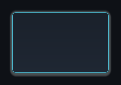{ width="130" } | `RoundedRect` | The only shape that reads `CornerRadius`. |
| 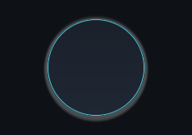{ width="130" } | `Circle` | Inscribed in the shorter axis. |
| 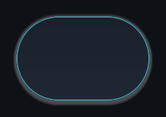{ width="130" } | `Capsule` | Fully rounded on the shorter axis. |
| 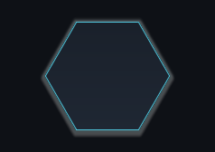{ width="130" } | `Hexagon` | Flat-top, inscribed in the rectangle. |
| 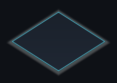{ width="130" } | `Diamond` | Inscribed in the rectangle. |

Every shipped skin draws all seven surfaces as `RoundedRect`, and only the status pip
shape varies between them — the other four wait for you to reach for one.

## Fill

| | `FillMode` | Uses |
| --- | --- | --- |
| 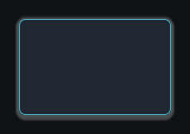{ width="130" } | `Flat` | `FillColor` only. The cheapest, and what Minimal Mono uses for every panel and button. |
| 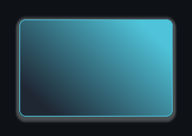{ width="130" } | `LinearGradient` | Both colours along `GradientAngleDegrees`: 0 points right, 90 points up. The other three shipped skins use it, at 90 degrees. |
| 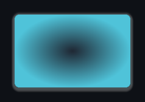{ width="130" } | `RadialGradient` | `FillColor` at the centre, `FillColorSecondary` at the edge. Only `StageBackdrop` is authored this way. |

`FillColorSecondary` is ignored by `Flat`, so a gradient that shows no gradient usually
means the mode is still `Flat` or the second colour was never moved off the first.

## Glow

Glow is drawn inside the shader, not by post-processing, so it cannot conflict with
your volumes or renderer features. It falls off outside the silhouette only, which is
why it reads as a halo rather than washing out the fill.

<figure markdown>
  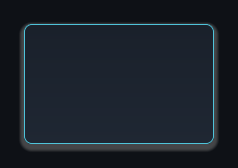{ .shot }
  <figcaption><code>GlowRadius = 0</code>, <code>GlowIntensity = 0</code> &mdash; no halo.</figcaption>
</figure>

<figure markdown>
  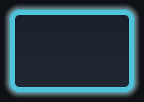{ .shot }
  <figcaption><code>GlowRadius = 22</code>, <code>GlowIntensity = 1.5</code>, glow colour from <code>Accent</code>.</figcaption>
</figure>

A glow needs `GlowRadius`, `GlowIntensity` **and** the alpha of `GlowColor` all above
zero. Any one of the three at zero draws nothing, which is the usual reason a glow
appears to do nothing. Of the seven surfaces only two are authored with one —
`PanelRaised` at half the skin's strength and `ButtonSelected` at full — and in
Parchment Atlas and Minimal Mono that strength is zero.

!!! tip "A glowing widget still occupies its rect"
    The mesh is padded so the halo is not clipped by its own quad, and that padding is
    excluded from layout. Raising `GlowRadius` never pushes neighbours around.

## The three button surfaces

Authoring all three is what makes a selection legible without any code:

| | Surface | When |
| --- | --- | --- |
| 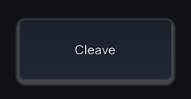{ width="150" } | `Button` | A legal command, and every timeline chip that is not acting. |
| 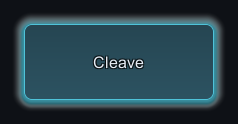{ width="150" } | `ButtonSelected` | Applied on click, until the tray rebuilds or the selection is cleared. |
| 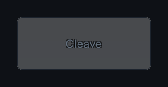{ width="150" } | `ButtonDisabled` | Concede — the only element drawn on it. |

Hovering a tray button raises the event that fills the tooltip and leaves the surface
alone, so `ButtonSelected` marks a decision rather than a pointer position. The tray
never draws an illegal command, so there is no greyed-out skill state to author for:
treat `ButtonDisabled` as the spent look for widgets of your own.

## When surfaces look flat

The shader lives at
`Assets/TurnGauge/Runtime/Presentation/Resources/TurnGauge/TurnGaugeSkinnedSurface.shader`.
It sits in a `Resources` folder on purpose, so it survives build shader stripping
without you adding it to **Always Included Shaders**. If it cannot be loaded, the
interface logs one warning naming that folder and every surface draws as a plain
rectangle — never magenta. Reimport the folder to restore it.

If the shader is loading and a surface still looks unfinished, one of its values is at
zero: a stroke needs `StrokeWidth` and the alpha of `StrokeColor`, a shadow needs
`ShadowRadius` and the alpha of `ShadowColor`.

## Next

- **[Bars, gauges and pips](skin-bars-and-pips.md)** — the five bar roles and the pip strip, built from these same surfaces.
- **[What each interface region draws](interface-regions.md)** — which region will show your changes.
- **[Restyle the interface](../tutorials/skinning-your-battle.md)** — turn a shipped skin into an asset you own, then swap skins at runtime.
