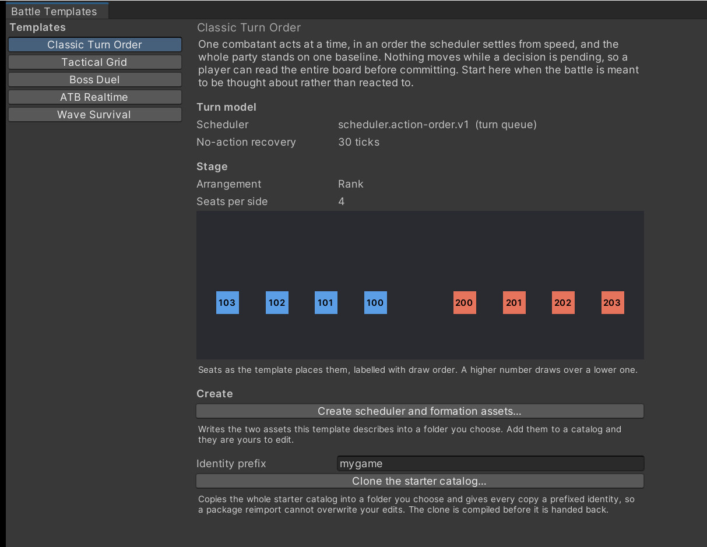

# Start from a battle template

Pick a turn model and a stage shape that go together, write them out as authoring assets you own,
and — when you want the shipped starter content as a starting point rather than as a reference —
clone the whole catalog under identities of your own.

Open **Tools > TempoForge > Battle Template Browser**.

{ .shot }

Nothing on this page is required. You can author every definition by hand
([Author content in the right order](author-content.md)) and place every seat yourself
([Place combatants with the Formation Editor](place-formations.md)). The browser exists because the
two ways to start before it were an empty catalog, which compiles to nothing until a dozen assets
exist, and hand-copying the samples, which the next package update overwrites.

## The five templates

| Template | Turn model | Stage | Seats a side |
| --- | --- | --- | --- |
| Classic Turn Order | Action order | Rank | 4 |
| Tactical Grid | Action order | Perspective | 6 |
| Boss Duel | Action order | Rank | 1 |
| ATB Realtime | ATB, gauges keep filling | Column | 4 |
| Wave Survival | ATB, gauges stop one short | Stagger | 5 |

The pairing is the part worth having, not the values. Turn model and stage shape are not independent
choices: a gauge filling in real time is unreadable on a stage where the party overlaps, and a
strict turn queue wastes a stage built to show six combatants at once. Each row is a pair that
works, and the browser draws the seats so you can see which one you are choosing.

### Reading the preview

The browser draws each seat where the template puts it, labelled with its draw order. A higher
number draws over a lower one.

That number is the point of the preview. Which seat overlaps which is the one thing about a
formation that cannot be judged from coordinates, and it is the thing that stays invisible until
real character art goes in — at which point the formation is hard to change. The conventions the
four arrangements follow, and why two of them disagree, are set out in
[Place combatants with the Formation Editor](place-formations.md).

## Write the two assets

**Create scheduler and formation assets…** writes a `SchedulerDefinition` and a
`FormationPresetDefinition` into a folder you choose. Add both to a `BattleContentCatalog` and they
are yours to edit; nothing keeps them tied to the template afterwards.

From code:

```csharp
using TempoForge.Authoring;

var template = BattleTemplateDefaults.TacticalGrid();
var scheduler = template.CreateScheduler();
var formation = template.CreateFormation("formation.my-battle");
```

Both are unsaved instances belonging to no catalog, in the same shape as
`FormationPresetDefinition.CreateTransient`. `BattleTemplateDefaults.All()` enumerates the five and
`Find(id)` looks one up by `BattleTemplate.TemplateId`.

### Why the scheduler keeps its ID and the formation does not

The formation preset takes whatever identity you pass. The scheduler does not, and this is worth
understanding before you rename anything.

A scheduler's stable ID is the key the compiler looks it up by in the scheduler registry. Rename
`scheduler.action-order.v1` and you do not get a renamed scheduler — you get a definition that
resolves to nothing, and an encounter that will not compile. It is the one place in the package
where a stable ID names a contract rather than a piece of content.

A scheduler you register yourself works exactly the same way; see
[Schedulers](../explanation/schedulers.md).

## Clone the starter catalog

The browser's second action copies the shipped starter catalog into a folder of your own and gives
every copy a prefixed identity, so `stat.power` becomes `mygame.stat.power`.

Set **Identity prefix** first, then **Clone the starter catalog…** and choose a destination inside
the project.

```csharp
using TempoForge.Editor;

var result = StarterContentCloner.Clone(
    StarterContentCloner.ShippedStarterCatalogPath,
    "Assets/MyGame/Content",
    "mygame");
```

`Clone` works on any catalog, not only the shipped one. The destination must differ from the source
folder, and the prefix cannot be empty — cloning without renaming would leave two catalogs in one
project claiming the same identities.

### What gets rewritten

Renaming identities across a copied asset graph is where a tool like this corrupts content quietly,
so the rules are worth stating rather than trusting.

**Object references are retargeted.** A copied encounter points at the copied teams, not at the
shipped ones.

**Stable IDs held as text are rewritten too.** Not every reference between definitions is an object
reference. The shipped damage effect names its source stat in a property bag, as text
(`source-stat-id: stat.power`). A clone that renamed the stat asset and left that text alone would
produce a catalog whose damage formula reads a stat the catalog no longer contains.

**Registry keys are left exactly as they are.** The same property bag also names a registered
formula, `formula.standard-damage.v1`, in the same kind of field. That is not any asset's identity,
so it survives untouched. The rule is that an ID resolving in a registry names a contract, not
content — which is why the rewrite is keyed on what is actually being cloned rather than on the
field's name.

Every identity kept this way is listed back to you when the clone finishes, so a kept ID never looks
like one the tool missed.

### The check that matters

The clone is compiled before the dialog appears, and `CloneResult.Diagnostics` carries whatever the
compiler said.

This matters more than the three rules above. A reference the tool failed to follow does not stay
hidden: it points at content the cloned catalog does not contain, so the compile reports it as a
dangling reference. The rules are the intent; the compile is the evidence.

```csharp
if (!result.Compiled)
{
    foreach (var diagnostic in result.Diagnostics)
    {
        Debug.LogError(diagnostic);
    }
}
```

A clone that does not compile is left on disk rather than rolled back, so the diagnostics can be
checked against the assets that produced them.

### What is not copied

Sprites, fonts and materials an icon field points at. The clone keeps referencing the same art, so
cloning a catalog does not double the size of your project. If you want your own art in as well,
[Use your own character art](use-your-own-art.md) covers that separately.

## Next

- [Author content in the right order](author-content.md) — what to fill in once you have a catalog
- [Place combatants with the Formation Editor](place-formations.md) — editing the seats the template gave you
- [Step a battle in the Workbench](balance-with-the-workbench.md) — running what you just built
- [Shape the perform moment](the-perform-moment.md) — making it feel like something
