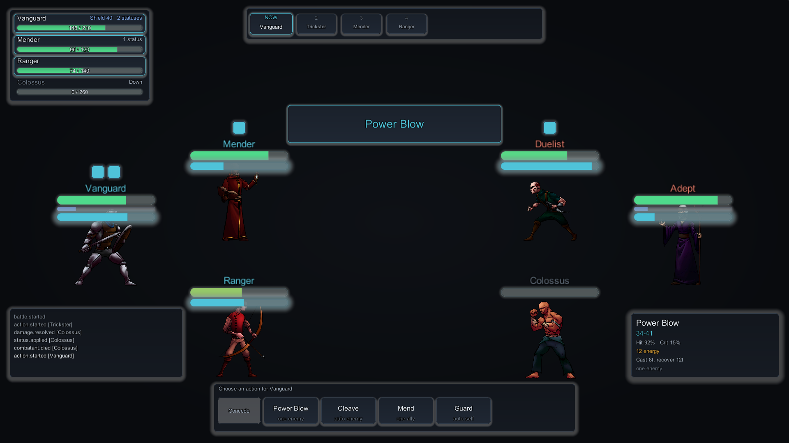

# Shape the perform moment

The perform moment is what a skill landing looks and feels like: the name announced as the
action opens, the rest of the field receding, the camera pushing in and jolting, the struck
body reacting, the bloom flaring. This page covers what ships, how to tune it, and how to
replace any part of it with your own.

You need a bound presenter ([guide 3](../tutorials/show-the-battle.md)) and recipes that name
keys ([Turn events into visuals](presentation-recipes.md)).



The card above is drawn from the same surface and typography tokens as every other region, so it
inherits whichever skin is applied without any per-skin work.

## What ships, and in what order

The presenter holds a list of **perform modules** and runs them in order as each phase of a
beat begins. The shipped effects are simply the first entries in that list:

| Module | Fires on | What it does | Pipeline |
| --- | --- | --- | --- |
| `SkillAnnouncementPerformModule` | opening phase | Puts the skill name on `SkillTitleView` | any |
| `FocusPerformModule` | opening, released on closing | Dims every combatant not taking part | any |
| `BodyShakePerformModule` | impact | Jolts the struck combatant | any |
| `CameraShakePerformModule` | any phase requesting a shake | Shakes the camera transform | any |
| `CameraZoomPerformModule` | impact | Pushes an orthographic camera in | any |
| `BloomPulsePerformModule` | impact | Flares the optional `BattleStageBloom` | Built-in only |
| `VignettePulsePerformModule` | impact | Closes the optional `BattleStageBloom` vignette in | Built-in only |
| `BackdropBlurPerformModule` | opening, released on closing | Pulls the optional `BattleStageBackdrop` out of focus | any |

The announcement fires on the **opening** phase rather than on impact, so the card is up before
the blow lands and the player reads what is coming rather than what already happened.

!!! note "A presenter with no modules behaves exactly as before"
    The list starts empty. Nothing here is imposed on an existing project, and removing every
    module returns you to plain three-phase beats.

## Tune the feel without touching code

`PerformFeelPreset` holds how much of each effect, once, for the whole game. Create one with
**Assets ▸ Create ▸ TempoForge ▸ Perform Feel Preset** and assign it.

Recipes say *what* happens on an event; the feel preset says *how hard*. That split is why
tuning the punch of your whole game is a handful of sliders rather than an edit across every
recipe, and why you can ship several presets and swap them per chapter.

| Group | Sliders |
| --- | --- |
| Announcement | title hold, title fade |
| Focus | dim amount, fade time |
| Camera | zoom amount, shake strength, shake time |
| Bodies | body shake strength, settle time |
| Bloom | pulse amount, pulse time |
| Vignette | pulse amount, pulse time |
| Backdrop | blur amount, focus-pull time |

Nothing on the preset can reach the simulation, so no amount of tuning can change a battle's
outcome or its event-chain digest.

## Wire it up

This is the whole registration, and it is deliberately this short:

```csharp
var feel = myFeelPreset;                 // or null for the shipped defaults
var camera = Camera.main;

presenter.PerformModules.Add(new SkillAnnouncementPerformModule(titleView, labels, feel));
presenter.PerformModules.Add(new FocusPerformModule(feel));
presenter.PerformModules.Add(new BodyShakePerformModule(feel));
presenter.PerformModules.Add(new CameraShakePerformModule(camera.transform, feel));
presenter.PerformModules.Add(new CameraZoomPerformModule(camera, feel));
```

The order in the list is the order they run in. Cut what you dislike, reorder what you keep.

## Write your own module

A module is one small interface. This one flashes the screen white on a killing blow:

```csharp
public sealed class KillFlashModule : IPerformBeatModule
{
    private readonly Graphic overlay;
    private float remaining;

    public KillFlashModule(Graphic whiteOverlay) { overlay = whiteOverlay; }

    public void OnPhaseBegin(PerformPhaseContext context)
    {
        // Only on impact, and only when the blow was lethal.
        if (!context.IsImpact) return;
        if (context.Beat.EventTypeId.Value != "combatant.died") return;
        remaining = 0.18f;
    }

    public void Tick(float presentationDeltaSeconds)
    {
        if (remaining <= 0f) return;
        remaining -= presentationDeltaSeconds;
        var alpha = Mathf.Clamp01(remaining / 0.18f);
        overlay.color = new Color(1f, 1f, 1f, alpha);
    }

    // Put the world back. A skip jumps straight here.
    public void Reset()
    {
        remaining = 0f;
        overlay.color = new Color(1f, 1f, 1f, 0f);
    }
}
```

Register it like any other: `presenter.PerformModules.Add(new KillFlashModule(overlay));`

### Three rules worth following

**`Reset` must undo everything.** A player who fast-forwards jumps past the phases that would
have released your effect, and the presenter calls `Reset` instead. A dim, a zoom or a camera
offset that survives its beat is not a dropped frame; it is a stage left wrong for the rest of
the session. The shipped modules are tested by resetting mid-effect and asserting the camera
lands back *exactly* where it started.

**Never do anything authoritative.** Modules run after the simulation has already decided the
outcome, and they are skipped entirely when a player fast-forwards. Anything that matters must
not live here.

**Throwing is contained, but still yours to fix.** The presenter catches what a module throws,
reports it once, and runs the remaining modules, so one broken module cannot stop a battle. It
will not, however, make your effect work.

## Post-processing, and what works where

Effects that move a transform — the shakes and the zoom — work in every render pipeline.

Image effects do not. `BattleStageBloom` is a Built-in render pipeline component: under URP or
HDRP its callback is never invoked, so it detects the active pipeline, logs one explanatory
warning naming the volume overrides to use instead, and disables itself. `BloomPulsePerformModule`
goes quiet with it rather than pretending to work.

That is also why the focus pull **tints renderers rather than blurring the frame**. A dim costs
nothing, works everywhere, and cannot collide with post-processing you already run.

### A background blur that works everywhere

If you want the background genuinely out of focus, add `BattleStageBackdrop` to the battle
camera and register `BackdropBlurPerformModule`.

It is not an image effect, which is exactly why it has no pipeline restriction. It renders the
scene a second time — with TempoForge's own tokens and interface hidden for the duration of that
render — into a half-resolution `RenderTexture`, softens it through a chain of bilinear blits,
and shows the result on a quad behind the stage. A camera, a render target and `Graphics.Blit`
behave identically under Built-in, URP and HDRP.

Two consequences worth knowing:

- **Only the background blurs.** The participants are excluded from the capture, so they stay
  sharp and never ghost behind a blurred copy of themselves.
- **It costs nothing when idle.** Everything is allocated on the first frame the strength rises
  above zero and released the moment it returns to zero, so a battle with no perform moment
  pays for none of it.

It composes with the focus tint rather than replacing it: run both and non-participants dim
while the world behind them softens. Or drop the tint and keep only the blur.

Anything else you would rather have is still a module you can write — which is the point of the
seam.

## Next

- **[Turn events into visuals](presentation-recipes.md)** &mdash; which keys fire on which event, in three phases.
- **[Use your own character art](use-your-own-art.md)** &mdash; the prefabs and sprites the moment stages.
- **[What each interface region draws](interface-regions.md)** &mdash; where the title card sits among the rest.
