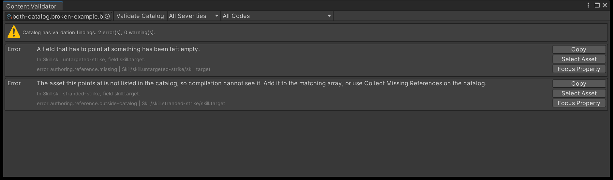

# Troubleshooting

Match a symptom to its cause. This page covers the failures that are not tied to one
authoring or presentation task; the pointer table near the end names the page that owns each
of the rest.

## Read the message before you change anything

Two surfaces tell you what went wrong, in words, before you have to guess.

**The Content Validator** reports authoring problems. **Tools > TempoForge > Content
Validator**, assign a catalog, press **Validate Catalog**. Each finding is three lines:

1. A plain-English sentence saying what is wrong and what to do about it, such as *"The asset
   this points at is not listed in the catalog, so compilation cannot see it. Add it to the
   matching array, or use Collect Missing References on the catalog."*
2. Where it is, in words rather than in the compiler's slash notation. It names the category,
   the owner, the field, and the entry and item number when the finding has them - *"In Skill
   skill.strike, field skill.effects, entry effect.hit, item 0."* - followed by `Detail:` and
   whatever extra the compiler recorded, which is often the whole answer.
3. The machine line, quietly, for when you are quoting it to somebody else.

Both rows above are the same mistake seen twice: a skill whose target field points at an asset
the catalog does not list, and a skill whose target field was left empty. They carry different
codes, which is what the code popup filters on.

The code popup in the toolbar names findings the same way - **Not in the catalog**, **Value
out of range**, **Battle cannot start** - so you can filter by problem rather than by code.
Three buttons sit on each row: **Copy** puts the machine line on the clipboard, **Select
Asset** pings the asset, and **Focus Property** selects it and remembers which field to open.

!!! note "Validation is the compile"
    `Validate` runs the identical pipeline `Compile` runs and then throws the result away, so
    a clean report means a clean compile. It never writes, dirties or imports an asset, and
    the report is discarded on window close or a script reload.

**The Console** reports runtime problems. A `BattleRuntimeController` that fails writes one
line naming the typed failure and then the detail, for example
`TempoForge Battle Runtime Controller 'Battle': EncounterNotFound. ...`. The typed name is
the same value your code reads from `result.Failure`, so a Console line and a scripted check
always agree. Three ordinary rejections a host can hit on any frame - `BattleNotRunning`,
`InvalidTickCount` and `CommandTranslationFailed` - are logged as warnings so they do not
read as a crash; everything else is an error. Logging is on by default and can be turned off
on the controller, and it is play-mode only, so an editor tool exercising a fail-closed path
stays quiet.

Without that line a mistyped encounter ID would be an empty screen and complete silence, so
check the Console first when a battle does not appear.

## The interface looks flat

Panels and bars render as plain rectangles with no shading, gradient or glow.

**Cause:** the skinned-surface shader could not be loaded, so every widget fell back to
uGUI's default material. One console warning names the `Resources` path that failed.

**Fix:** reimport `Assets/TempoForge/Runtime/Presentation/Resources`. The shader lives in a
`Resources` folder on purpose -- that is what carries it through build shader stripping
without you adding it to **Always Included Shaders**.

The fallback is deliberate: a missing shader degrades to flat colour rather than drawing
magenta, so a build still shows a readable interface.
[`SkinMaterialPool.IsShaderAvailable`](../reference/skinning-and-appearance.md#skinmaterialpool)
reports the same condition in code.

## The battle does not advance

Read the outcome your pump returned before changing anything else.

| Outcome | Meaning | What to do |
| --- | --- | --- |
| `AwaitingCommand` | A player-controlled decision is pending | Submit a command. The engine will not move until one arrives |
| `NoScheduledWork` | Nothing left to schedule, and no result | A content fault: no living actor has an available action |
| `FatalInvariant` | An invariant broke | Stop pumping and report it with the encounter ID and seed |
| `Terminal` with `battle.stalled` | An authored cap was reached with both teams still standing | A content fault: mutual immunity, unpayable costs, or healing that outpaces all damage |

If nothing happens at all, confirm you are converting accumulated presentation time to an
**integer** tick count and that it is not always rounding to zero. `AdvanceTicks(0)` returns
`ReachedTarget` and does nothing, so a multiplier that is too small gives you a battle that
never starts rather than an error.

!!! warning "An uncapped encounter cannot stall"
    `battle.stalled` is reached only once the battle rules pass **Maximum Battle Ticks** or
    **Maximum Root Actions**. Both are `0` in a newly created rules asset, and `0` means no
    cap, so content with no path to resolution pumps forever instead of terminating. The
    starter rules set 100,000 ticks and 512 root actions.

## Clicking a skill does nothing

Work down this list in order.

1. **Is there an `EventSystem` in the scene?** `BattleUiRoot` adds its own canvas and graphic
   raycaster, but it does not create an `EventSystem`, and without one no uGUI element
   receives a pointer at all.
2. **Is a decision pending for a player-controlled actor?** The tray hides itself whenever
   the pending decision has no human actor, so an AI turn offers nothing to click.
3. **Are you subscribed to `CommandChosen` and submitting?** The interface raises the choice
   as a plain C# event and submits nothing itself.
4. **Is the skill legal at this tick?** The tray only draws the shapes the snapshot permits.
   Cooldowns, resource costs and restriction tags remove the rest before the tray is built,
   so an illegal skill is absent rather than greyed out.

See [Take a decision from the player](../tutorials/take-player-input.md) for the submission
side of that loop.

## Keyboard shortcuts do not work

The number keys and ++esc++ require the legacy input backend (**Project Settings > Player >
Active Input Handling: Input Manager** or **Both**). Without it
`BattleUiRoot.LegacyInputAvailable` is false and `BattleUiRoot.InputUnavailableMessage`
carries the explanation you can show a tester.

Nothing throws. The tray stays fully usable by pointer -- only the shortcuts are gone.

## The same seed gives different results

The simulation assembly cannot see Unity's RNG, its clock or a frame counter, so a
difference always arrives through one of the inputs you supplied.

- **The seed.** Seeding from `UnityEngine.Random`, `DateTime.Now` or a frame count gives a
  different battle every run. Choose the seed yourself, store it, and show it.
- **The content.** A result is a function of content *and* seed. Compare
  `snapshot.ContentManifestHash` across the two runs before suspecting anything else.
- **The tick a command landed on.** Command order and requested tick are part of the input,
  so a human decision submitted a frame later is a different battle.

For a human-controlled combatant on an ATB scheduler, author `InputPausePolicy` as
`PauseOnInput`. Presentation speed then cannot move the tick a submission lands on. The
shipped starter scenarios are all automatic, so this only arises once you author a human
combatant -- see [Schedulers and tempo](../explanation/schedulers.md).

## Editor windows are empty after a script reload

This is by design rather than a lost window.

The Workbench serialises only plain selection state: catalog, encounter ID, seed and batch
settings. The live session, the compiled catalog and the batch controller are dropped before
an assembly reload, because an editor window holding a Unity object across a domain reload
would hand out destroyed objects afterwards. Compile and start the battle again; your
selection is still in the toolbar.

The Skin Browser rebuilds its list every time the window takes focus, so click into it once
after adding or deleting a skin asset.

## Symptoms covered elsewhere

| Symptom | Page that owns it |
| --- | --- |
| A label reads `50000` instead of `5`, or `875000` instead of `87.5%` | [Determinism](../explanation/determinism.md#never-print-these-types-directly) |
| Compilation or validation fails and names an asset | [Author content in the right order](author-content.md) |
| A finding says a catalog can only carry one turn model | [Schedulers and tempo](../explanation/schedulers.md#one-catalog-one-turn-model) |
| A replay refuses to play back, or diverges from the recording | [Record and replay a battle](record-and-replay.md) |
| Tokens are the wrong size or in the wrong place | [Place combatants with the Formation Editor](place-formations.md) |
| The interface overlaps your own UI | [Fit the battle to your screen](interface-layout.md#hide-what-you-replace) |
| Motion is too fast, or a tester reports discomfort | [Bars, gauges and pips](skin-bars-and-pips.md#motion-and-reduced-motion) |
| A damage or healing number is not the one you expected | [Step a battle in the Workbench](balance-with-the-workbench.md) |
| Batches report a nonzero stall rate | [Run Monte Carlo batches](monte-carlo-batches.md) |
| An event draws no animation, effect or sound | [Turn events into visuals](presentation-recipes.md) |

## Getting help

Include all of this:

- Unity version and render pipeline.
- The **encounter ID** and the **seed**.
- The console output, including any TempoForge warning. The controller's lines carry the
  typed failure name, which is the most useful single word in the report.
- Any Content Validator finding, copied with its **Copy** button so the machine line comes
  with it.
- The replay file, if you have one.

A battle is a function of its compiled content, start request, seed and submitted commands,
so an encounter plus a seed usually reproduces the problem exactly on another machine.

## Next

- **[The engine loop](../explanation/engine-loop.md)** -- every advance outcome, and what a
  snapshot is authoritative for.
- **[Determinism](../explanation/determinism.md)** -- the inputs a battle is a function of,
  and which of your own choices can break them.
- **[Record and replay a battle](record-and-replay.md)** -- capture the battle that went
  wrong so someone else can replay it.
