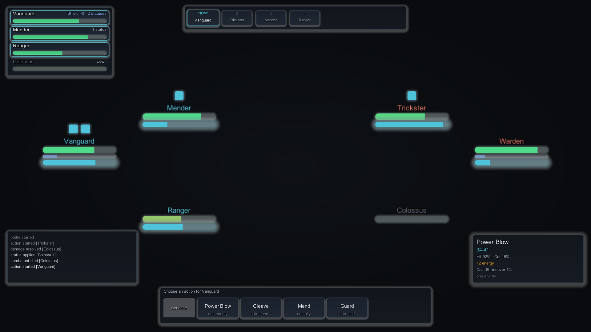
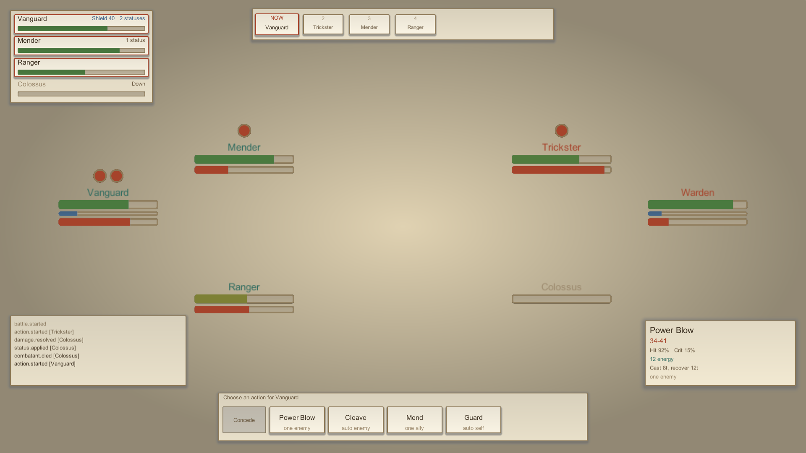
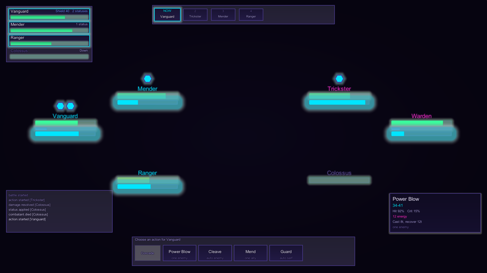
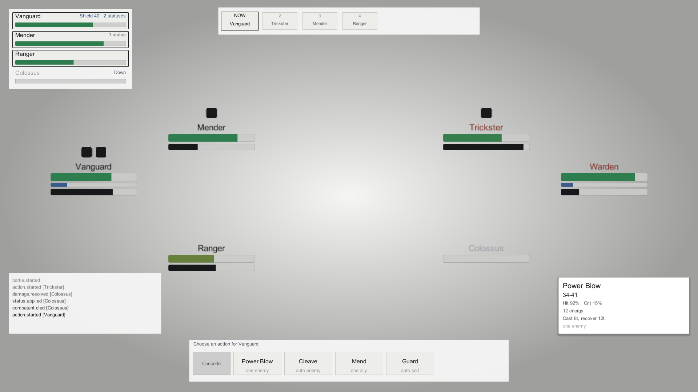

---
hide:
  - navigation
---

<div class="hero" markdown>

# TempoForge

<p class="tagline">Deterministic, replayable turn and tempo battles for Unity. Action-order
or ATB scheduling, formations, statuses, reactions, AI policies, a Monte Carlo balancing
workbench, and a battle interface you can restyle from one asset.</p>

</div>

{ .shot }

/// caption
Slate Nocturne, the default skin. Roster, turn-order strip, skill tray, tooltip, log, and
the plates above each combatant are drawn by a signed-distance-field shader &mdash; no
texture and no font ship with the package. **Character art is yours:** this frame shows only
what TempoForge itself renders, which is why the combatants are plates over empty ground.
///

---

## Choose your path

<div class="cards" markdown>

<div markdown>

### :material-rocket-launch: I want to see it work

Run the demo, prove determinism with a seed, then start a battle from your own code.

[Your first battle :material-arrow-right:](tutorials/first-battle.md)

</div>

<div markdown>

### :material-palette: I want it to match my game

Pick a skin, make it yours, and move every interface region where you want it.

[Skinning your battle :material-arrow-right:](tutorials/skinning-your-battle.md)

</div>

<div markdown>

### :material-scale-balance: I want it to be fair

Step a battle tick by tick, read every formula trace, run Monte Carlo across seeds.

[Balance with the Workbench :material-arrow-right:](how-to/balance-with-the-workbench.md)

</div>

<div markdown>

### :material-book-open-variant: I need to look something up

417 public types, grouped by what they are for and filterable as you type.

[API reference :material-arrow-right:](reference/index.md)

</div>

</div>

---

## What it does

You author content as assets. A **compiler** freezes it. The **engine** runs a battle from
`(content, encounter, seed)` and emits events plus snapshots. A **presenter** draws them. An
interface offers legal choices and raises intent; **your driver** submits commands.

The same `(encounter, scheduler, formation, seed)` tuple always produces the same state
hashes and the same replay. That is structural rather than promised:

- `TempoForge.Simulation` is compiled with `noEngineReferences: true`, so it cannot reach
  `UnityEngine.Random`, `Time`, or a `GameObject`.
- Amounts are `Fixed64` and chances are `Chance64`, both integer-backed. No float reaches a
  value that feeds a hash.
- Pause, speed, and skip scale the *visual* clock only.

=== "Running a battle"

    ```csharp
    var result = new BattleContentCompiler().Compile(
        AuthoringCompileRequest.WithBuiltIns(catalog));

    var encounter = result.CatalogSnapshot.Encounters[0].Value;

    var engine = BattleEngine.Create(
        result.CatalogSnapshot.BattleContent,
        encounter.StartRequest,
        seed: 12345u,
        result.CatalogSnapshot.SchedulerRegistry,
        result.CatalogSnapshot.MechanicsRegistry);

    var step = engine.AdvanceTicks(ticks);   // events + snapshot + outcome
    ```

=== "The interface submits nothing"

    ```csharp
    ui.CommandChosen += choice =>
    {
        var snapshot = engine.GetSnapshot();

        var command = new BattleCommand(
            snapshot.NextCommandSequence, snapshot.Tick, BattleIds.UseSkillCommand,
            choice.ActorId, choice.SkillId, choice.Targets, PropertySet.Empty);

        engine.Submit(command);   // only the driver submits
    };
    ```

=== "Showing numbers"

    ```csharp
    // Fixed64.ToString() returns raw scaled integers, because that string feeds
    // canonical encoding. Never show it to a player.
    BattleNumberFormat.Amount(value);           // "5.25"
    BattleNumberFormat.AmountRange(min, max);   // "10-14"
    BattleNumberFormat.Percent(chance);         // "87.5%"
    ```

---

## Four shipped skins

Every look is drawn procedurally from numbers in a `BattleSkinPreset`. None ship a texture
or a font, and any of them becomes yours with one click in the Skin Browser.

<div class="grid-2" markdown>

<figure markdown>
  { .shot }
  <figcaption><strong>Slate Nocturne</strong> &mdash; the default. Dark slate, cyan and amber accents.</figcaption>
</figure>

<figure markdown>
  { .shot }
  <figcaption><strong>Parchment Atlas</strong> &mdash; warm paper, inked borders, circular pips.</figcaption>
</figure>

<figure markdown>
  { .shot }
  <figcaption><strong>Neon Circuit</strong> &mdash; saturated rims, heavy halos, hexagonal pips.</figcaption>
</figure>

<figure markdown>
  { .shot }
  <figcaption><strong>Minimal Mono</strong> &mdash; light, flat, hairline borders. The neutral base.</figcaption>
</figure>

</div>

---

## Requirements

- Unity **2022.3 LTS** or newer
- Built-in render pipeline, URP, or HDRP &mdash; no render-pipeline package required
- No third-party dependencies, no DRM, no telemetry, no online activation

!!! info "Documentation only"
    This site documents TempoForge. The product source is not published here.
