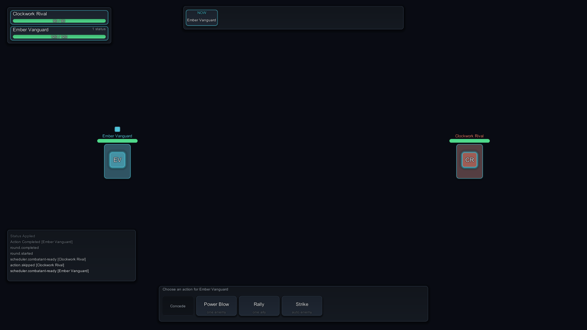

# 1. Install and run the demo

Import the package, press Play on the shipped scene, and take the first turn yourself. Then
run one seed twice and see for yourself that nothing about the battle moved.

---

## Install

1. Import TurnGauge into a Unity project. Everything lands under `Assets/TurnGauge/`, and
   no third-party package comes with it.
2. Choose **Tools > TurnGauge > Open Runtime Demo**. That saves what you have open and opens
   `Assets/TurnGauge/Samples/RuntimeDemo/TurnGaugeDemo.unity`.
3. Press **Play**.

There is no fourth step.

!!! note "What has been verified"
    Unity 2022.3.62f1 on the Built-in render pipeline is the configuration with recorded
    evidence, and Unity 2022.3 LTS is the floor. URP, HDRP, newer editor streams including
    Unity 6, and every platform beyond the editor are pending rather than supported.
    TurnGauge is a working name pending legal clearance.

Four things you might expect to set up and do not:

- **No shader or material step.** Every panel, bar, plate and pip is drawn procedurally by one
  shader that ships inside a `Resources` folder, so it survives build shader stripping.
- **No font asset.** With no font assigned on the skin, text falls back to Unity's built-in
  `LegacyRuntime.ttf`.
- **No Event System.** The demo scene holds a camera, the driver and the interface, and nothing
  else. uGUI needs an `EventSystem` before any element receives pointer input, so the demo
  creates one with a `StandaloneInputModule` when Play begins and the scene has none. Pointer,
  keyboard and legacy gamepad navigation all work without you adding anything.
- **Six drawn characters are included, and you may ship them.** They live under
  `Samples/Characters/`, the demo uses them, and they are licensed with the package for use in
  your own commercial projects, not look-but-do-not-touch demo art. The two archetypes without a
  drawing fall back to a generated role glyph, which is what an unfilled slot looks like. To swap
  in your own, see [Use your own character art](../how-to/use-your-own-art.md).

## Take the first turn

Play compiles the two starter catalogs and starts the picker's first scenario, **Playable Duel**,
on seed `12345`. One of its two combatants is authored as **Human**, so the battle is not an
attract loop: it runs until your hero is asked what to do, and then waits for you.

1. Press **Play** and watch the opening beats. **Clockwork Rival** is faster and moves first;
   the log in the bottom left names every event as it resolves.
2. When **Ember Vanguard** comes up, the battle stops. The skill tray fills along the bottom with
   that hero's legal choices, and nothing advances until you pick one.

    { .shot }

3. Click a skill. The caption under each button says what it may aim at, so **Power Blow** reads
   "one enemy" and **Strike** reads "auto enemy".
4. Pick a target if the skill needs one. A skill whose caption starts with "auto" is sent straight
   away. Any other skill replaces the tray with the target list, one button per combatant that
   skill may legally hit; click one and the choice is submitted, or press **Back** to return to
   the tray.
5. Watch the result land. The events play out, the log grows, the plate over the token picks up a
   status pip, and the tray comes back for the hero's next decision.

    { .shot }

6. Keep choosing until one side falls. The result banner appears in the centre when the battle
   reaches a terminal result.

The tray follows the pending decision rather than the clock. It is on screen only while a
**human**-controlled actor owes a decision, and it hides itself the moment the engine stops
waiting, which is why the eight automated scenarios never show it.

### What is on screen

| On screen | Where | Fed from |
| --- | --- | --- |
| Plate over each token: name, health bar, shield bar while a shield holds, one pip per status | Above the stage tokens | the snapshot |
| Roster, one row per combatant | Top left | the snapshot |
| Turn-order strip | Top centre | the snapshot's decision entries |
| Battle log | Bottom left | the event stream |
| Skill tray and Concede | Bottom centre | the legal choices compiled from the snapshot |
| Scenario picker, seed field, playback row, status line | Top right | the demo driver |
| Result banner | Centre, at the end | the terminal result |

### The nine scenarios

The picker spans nine authored scenarios. **Playable Duel** is offered first because it is the
one with a human combatant. Then come the seven automated showcases from the same catalog:
Boss and Minions, DOT Pressure, Formation Showcase, Healer Check, Mirror Brawl, Reaction
Showcase and Tutorial Duel. **ATB Rush** is last, and runs the ATB scheduler out of its own
catalog.

`<` and `>` move the selection only. The running battle continues until you press **Start**.

## Prove determinism

Every other page rests on this property, so watch it happen once.

=== "From the Inspector"

    1. Select the **TurnGaugeDemo** object and note its **Seed** field (`12345`).
    2. Press Play and play the duel to its end. Read the last log lines and the result.
    3. Stop and press Play again. Make the same choices in the same order: the same events
       resolve in the same order with the same numbers, and the same side wins.
    4. Change **Seed** by one and press Play. The battle diverges.

=== "From the transport bar"

    1. Press Play, then type a number into **Seed** in the top right.
    2. Press **Start**. A fresh engine runs the selected scenario on that seed.
    3. Press **Start** again with the same number and repeat your choices. It resolves
       identically.

    Text the field cannot read as an unsigned integer is ignored, and the current seed is kept.

A battle is a function of its inputs: the encounter, its scheduler, its formation, the seed,
and the commands submitted. Hold those and the engine reproduces the same state hash, the same
event-chain hash and the same result every time. Your own choices are part of that tuple, which
is why a playable scenario has to be replayed the same way to land in the same place; an
automated scenario needs only the seed.

!!! tip "Compare hashes, not log lines"
    The demo displays no hashes. Open the same scenario and seed in
    **Tools > TurnGauge > Battle Workbench**, which prints the event-chain hash beside its
    event log. That is the value which must not move. See
    [Step a battle in the Workbench](../how-to/balance-with-the-workbench.md).

!!! warning "Content is an input too"
    Edit a stat, a skill or an encounter and the same seed gives a different battle. That is not
    a determinism failure, it is a different set of inputs.
    [Determinism](../explanation/determinism.md) lists everything the tuple covers.

## What the transport controls change

At 1x, one second of presentation time becomes 30 simulation ticks, handed to the engine as an
integer tick count. The controls change how that conversion happens and nothing else.

| Control | Key | What it changes |
| --- | --- | --- |
| **Pause** | `Space` | The driver stops requesting ticks. Visual beats already queued keep playing out. |
| **Speed** | `Tab` | Cycles 0.5x, 1x, 2x, 4x. Presentation time converts to ticks that much faster, and queued beats play at that rate. |
| **Skip** | `Enter` | Finishes every queued visual beat now. No simulation value is touched. |
| `<` `>` | -- | Selects the previous or next scenario, wrapping at both ends. |
| **Start** | -- | Tears down the current battle and creates a fresh engine for the selected scenario on the seed in the field. |

None of that can change a result. Advancing seven ticks at a time and advancing seven hundred
produce the same hashes, so your frame rate and your speed setting are invisible to the
simulation. The shipped test suite asserts this directly: it runs the demo driver and a
Workbench session over the same tuple at different tick batch sizes and requires both hashes
to match.

The keyboard shortcuts need the legacy input backend (**Project Settings > Player > Active
Input Handling: Input Manager** or **Both**). Without it the buttons still work.

!!! note "Your own decisions are the exception"
    Once a player chooses, the tick their command lands on is itself an input, so a faster or
    slower clock could move it. Authoring the scheduler's input pause policy as `PauseOnInput`
    removes that risk. See [Schedulers and tempo](../explanation/schedulers.md).

For a shipping build, tick **Hide Transport Controls** on the `BattleUiRoot` component. The
region is then not built at all, so the picker and playback row cost nothing.

## Next

- **[2. Put a battle in your scene](playable-battle-in-a-scene.md)** -- the same playable duel in
  a scene of your own, with no code at all.
- **[Determinism](../explanation/determinism.md)** -- what reproduces a battle exactly, and
  which of your own choices can break it.
- **[Troubleshooting](../how-to/troubleshooting.md#the-interface-looks-flat)** -- if the
  interface renders as flat rectangles with no shading.
