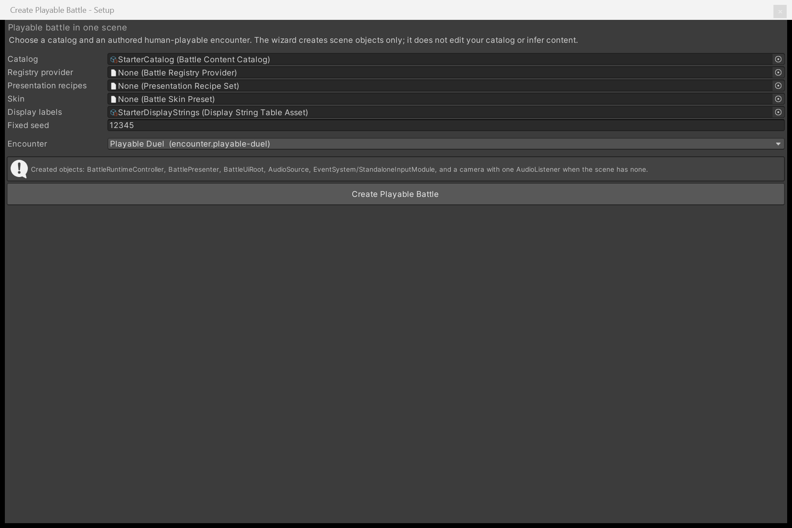
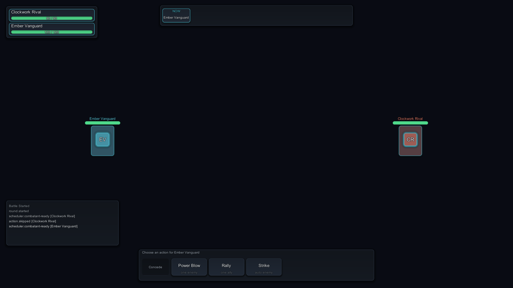

# 2. Put a battle in your scene

The demo is a scene you were given. This page builds the same playable duel in a scene of your
own, from a menu item and an Inspector, with no C# at all.

---

## Build the scene

1. Open the scene you want the battle in. A brand new empty scene is fine.
2. Choose **Tools > TempoForge > Create Playable Battle**. A window opens with a catalog and a
   label table already filled in.

    { .shot }

3. Leave **Catalog** on `StarterCatalog` and **Display labels** on `StarterDisplayStrings`. The
   labels are what turn `unit.playable-hero.1` into "Ember Vanguard" on screen.
4. Leave **Registry provider**, **Presentation recipes** and **Skin** empty. Empty means the
   shipped defaults: the built-in mechanics and schedulers, no authored visual beats yet, and the
   Slate Nocturne skin.
5. Leave **Fixed seed** at `12345`. The same seed and the same choices give the same battle every
   time you press Play.
6. Open **Encounter** and choose **Playable Duel (encounter.playable-duel)**.
7. Click **Create Playable Battle**. If your scene already has a camera, the wizard asks before
   pointing it at the battle; choose **Frame the battle**. Then click **OK** on the confirmation.
8. Press **Play** and take the turn, exactly as you did in the demo.

!!! note "Only encounters you can actually play are listed"
    The **Encounter** dropdown offers an encounter only when one of its living members is
    authored **Control: Human**. An encounter where every combatant is AI-controlled has no
    decision to hand you, so it is not in the list. TempoForge never rewrites an authored control
    kind to make one playable: that field is content, and content is part of what makes a battle
    reproducible.

The wizard edits scene objects only. It does not touch your catalog, invent content, or pick an
encounter for you.

## What the wizard made

One object named **TempoForge Playable Battle** with two children, and two more scene objects only
when your scene does not already have them.

| Object | Component | What it is for |
| --- | --- | --- |
| TempoForge Playable Battle | `BattleRuntimeController` | Owns the battle: compiles, starts, ticks, pauses for decisions |
| TempoForge Playable Battle | `AudioSource` | What the audio adapter plays through |
| Battle Presenter (child) | `BattlePresenter` | The stage, the tokens and their plates |
| Battle UI (child) | `BattleUiRoot` | Roster, turn strip, tray, log, result banner |
| EventSystem | `EventSystem` and an input module | Added only when the scene has none, so uGUI receives clicks |
| Main Camera | `Camera`, `AudioListener` | Added only when the scene has none |

Everything the wizard created is one undo step away: **Edit > Undo Create TempoForge Playable
Battle** removes it, and puts a camera it moved back exactly where it was.

## Read the controller

Select **TempoForge Playable Battle** and look at the **Battle** section. These fields are the
whole no-code setup.

{ .shot }

| Field | What to do with it |
| --- | --- |
| **Catalog** | The authoring catalog to compile. Swap it for your own once you have one. |
| **Encounter Id** | One exact stable id. A blank or unknown id fails with a message that names the problem; it never falls back to the first encounter it finds. |
| **Registry Provider** | Leave empty until you add mechanics or schedulers of your own. |
| **Human Control** | What the controller insists on before it starts. The default refuses to start an encounter with nobody for the player to be. |
| **Seed Policy** | `Fixed` replays the same battle from **Fixed Seed**. `Incrementing` adds the number of successful starts to it, so repeated runs of the same fight differ. |
| **Ticks Per Second** | How many battle ticks one real second is worth. Raise it to make every fight quicker. Only the whole tick count ever reaches the engine, so this changes pace and never a result. |
| **Auto Start** | Start the battle when the scene starts. Clear it to start from your own trigger. |
| **Auto Advance** | Let the controller turn frame time into ticks each `Update`. Clear it when something else drives the clock. |

The **Presentation** section below is where the scene objects are wired together. The wizard has
already filled the two that matter.

{ .shot }

- **Presenter** and **Ui Root** point at the two child objects. Clear both and the same battle
  runs with nothing drawn, which is how you would run one headlessly.
- **Recipes** is where a `PresentationRecipeSet` goes when you want events to play animations,
  effects and sound. See [Turn events into visuals](../how-to/presentation-recipes.md).
- **Skin** restyles every region. See [6. Restyle the interface](skinning-your-battle.md).
- **Inspector Events** at the bottom are UnityEvents. Drag any object in and call a method of
  your own when a battle starts, a snapshot changes, events are produced, a battle ends, or the
  runtime fails, without writing a listener.

## Press Play

The controller compiles the catalog, creates the engine on your seed, binds the presenter and the
interface, and pumps ticks. When the engine reaches a decision that belongs to a human, it stops
pumping and the tray fills.

{ .shot }

Clicking a skill, and picking a target when that skill needs one, is all there is to it.
`BattleUiRoot` raises the player's choice, the controller checks it against the pending actor and
the compiled legal choices, and submits it. Nothing in that path is yours to write.
[5. Take a decision from the player](take-player-input.md) covers what the controller checks, how
the target picker decides who is on offer, and how to submit a choice from your own UI instead.

## When it does not start

The controller fails closed and says why, in the Console and on screen.

| What you see | What it means |
| --- | --- |
| A message naming a missing encounter id | **Encounter Id** does not match any encounter in **Catalog**. Ids are exact text. |
| A human-control failure | The encounter compiled, but no living member is authored **Control: Human**. |
| A wall of compile diagnostics | The catalog itself is wrong. Run **Tools > TempoForge > Content Validator**, which lists the same diagnostics asset by asset and field by field. |

Leave **Log Failures** on while you are building. **Show Failure Banner** also prints the failure
in the Game view, so a mistyped encounter id is visible without opening the Console.

## Your own content in the same scene

Nothing above is specific to the starter catalog.

1. Author your own combatants, skills and an encounter:
   [Author content in the right order](../how-to/author-content.md).
2. Set at least one living team member's **Control** to **Human** on the team the player is.
3. Run **Tools > TempoForge > Content Validator** and clear what it reports.
4. Put your catalog in **Catalog** and your encounter's stable id in **Encounter Id**.
5. Press Play.

## Next

- **[3. Run a battle from your own code](run-a-battle-from-code.md)** -- what the controller is
  doing for you, for the projects that need to own the loop.
- **[Start from a battle template](../how-to/start-from-a-template.md)** -- a turn model and a
  stage shape that go together, written out as assets you own.
- **[5. Take a decision from the player](take-player-input.md)** -- submitting a choice from your
  own interface.
