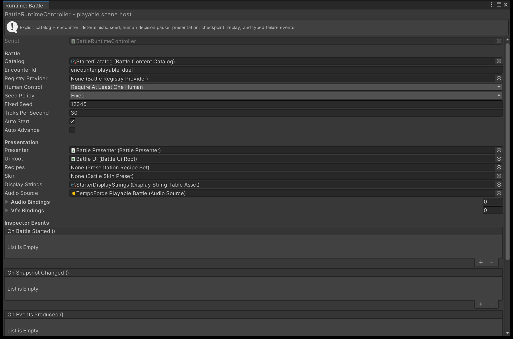

# 3. Run a battle from your own code

Compile a catalog, create an engine from one encounter and a seed, and advance that battle from
a `MonoBehaviour` you own. Nothing is drawn on screen yet: the stage and the interface arrive
on [page 4](show-the-battle.md).

---

## Do you need this page?

Probably not yet. Everything below is what `BattleRuntimeController` already does for you, and
[2. Put a battle in your scene](playable-battle-in-a-scene.md) sets that up from a menu item.
These fields are the same three decisions the first listing makes in code.

{ .shot }

Write your own loop when your game needs orchestration the controller does not offer: a custom
transport, a battle driven by a server, or a clock that is not Unity's. You can also keep the
controller and take only the clock, by clearing **Auto Advance** and calling
`AdvanceTicks` yourself.

The driver owns the engine, and everything else in the scene only receives values from it. The
three listings below are one file, in order.

## 1. Compile the catalog once

A `BattleContentCatalog` is authored Unity data, and the engine never reads it directly.
[`BattleContentCompiler`](../reference/compiling-and-validating-content.md#battlecontentcompiler)
walks the whole catalog, validates it, and freezes it into compiled content. Do that once at
load: creating an engine afterwards only builds the starting state of a single encounter.

```csharp
using TempoForge.Authoring;
using TempoForge.Simulation;
using UnityEngine;

public sealed class MyBattleDriver : MonoBehaviour
{
    [SerializeField] private BattleContentCatalog catalog;

    private CompiledAuthoringCatalog compiled;
    private BattleEngine engine;
    private float accumulator;

    private void Start()
    {
        var result = new BattleContentCompiler().Compile(
            AuthoringCompileRequest.WithBuiltIns(catalog));

        if (!result.Succeeded)
        {
            for (var i = 0; i < result.Diagnostics.Count; i++)
                Debug.LogError(result.Diagnostics[i].DiagnosticId.Value + " | " +
                    result.Diagnostics[i].Source.OwnerKey + "/" +
                    result.Diagnostics[i].Source.FieldToken.Value);

            return;
        }

        compiled = result.CatalogSnapshot;
```

`WithBuiltIns` supplies the shipped scheduler and mechanics registries. A compile that succeeded
can still carry warnings, so branch on `Succeeded` rather than on the diagnostic count. Each
diagnostic also carries `Source.Category`, an element key and a `HumanDetail` string; the Content
Validator prints the same set asset by asset. See
[Author content in the right order](../how-to/author-content.md).

## 2. Create the engine

An encounter compiles to a start request: which teams stand in which formation slots, who controls
each combatant, and which scheduler runs the battle. Hand that request a seed and the registries
from the same compiled catalog.

```csharp
        if (!compiled.Encounters.TryGetValue(
                new StableId("encounter.my-fight"), out var encounter))
        {
            return;
        }

        engine = BattleEngine.Create(
            compiled.BattleContent,
            encounter.StartRequest,
            seed: 12345u,
            compiled.SchedulerRegistry,
            compiled.MechanicsRegistry);
    }
```

`Encounters` is keyed and sorted by stable id, so `Encounters[0]` is the alphabetically first
encounter and moves the moment you rename an id. Look encounters up by id instead.

!!! warning "Pass the catalog's own registries"
    `BattleEngine.Create` has shorter overloads that build fresh built-in registries. Compiled
    content is bound to the registries that compiled it, and creating an engine with a registry
    that does not supply those bindings throws.

The seed is a `uint`. The same encounter, scheduler, formation and seed always produce the same
battle, as [Determinism](../explanation/determinism.md) sets out.

## 3. Convert frame time to ticks

The engine has no clock of its own. It advances only when you hand `AdvanceTicks` a whole number
of ticks, so a driver's entire timing job is turning frame time into integers: accumulate, floor,
keep the remainder.

```csharp
    private void Update()
    {
        if (engine == null) return;

        accumulator += Time.deltaTime * ContractVersions.TicksPerSecond;
        var ticks = (int)accumulator;
        if (ticks <= 0) return;
        accumulator -= ticks;

        var step = engine.AdvanceTicks(ticks);

        if (step.Outcome == AdvanceTicksOutcome.Terminal)
        {
            Debug.Log("Result: " + step.Snapshot.Result.ResultId);
            engine = null;
        }
    }
}
```

`ContractVersions.TicksPerSecond` is 30, the rate the shipped demo pumps at and the default in the
controller's **Ticks Per Second** field. No authored timing is expressed in seconds: cast time and
recovery are tick counts, and a cooldown or a status duration counts either elapsed ticks or the
owner's own turns. The rate you pick therefore changes how fast a battle looks and nothing about
how it resolves.

!!! note "The accumulator is not part of the battle"
    Fractional time never reaches the engine and never enters a replay. Keep the `ticks <= 0`
    guard: a count of zero returns immediately having done nothing, and a negative count throws
    `ArgumentOutOfRangeException`.

## 4. Read the outcome

One call returns the events that happened, the snapshot after them, and one outcome.

| Outcome | Meaning | What the driver does |
| --- | --- | --- |
| `ReachedTarget` | The full tick count was advanced. | Keep pumping. |
| `AwaitingCommand` | A decision is exposed that the engine will not make for you. | Submit a command, then pump again. |
| `Terminal` | The battle ended; `Snapshot.Result` holds how. | Stop pumping. |
| `NoScheduledWork` | Nothing further is scheduled and the battle has not ended. | Stop pumping. |
| `FatalInvariant` | `Diagnostic` carries the reason. | Stop pumping rather than retry the call. |

`AwaitingCommand` is what a player's turn looks like from inside the loop: the engine stops short
of the target tick and waits, however many ticks you ask for afterwards. This is the same pause
you watched in the demo, seen from the driver's side.

{ .shot }

Building and submitting that command is [page 5](take-player-input.md).

`Snapshot.Result` is the authority on how a battle ended. `IsTerminal` stays false until it does;
then `ResultId` is one of `battle.victory`, `battle.defeat`, `battle.concession`, `battle.draw` or
`battle.stalled`. The first three also carry `WinningTeamId` and `LosingTeamId`; the last two carry
neither. `step.Events` is the record of what happened and `step.Snapshot` is the state after it.
[The engine loop](../explanation/engine-loop.md) sets out what each is authoritative for.

## Next

- **[4. Draw the battle on screen](show-the-battle.md)** -- bind a presenter to the same compiled catalog.
- **[The engine loop](../explanation/engine-loop.md)** -- what one `AdvanceTicks` call does, outcome by outcome.
- **[5. Take a decision from the player](take-player-input.md)** -- turn `AwaitingCommand` into a submitted command.
