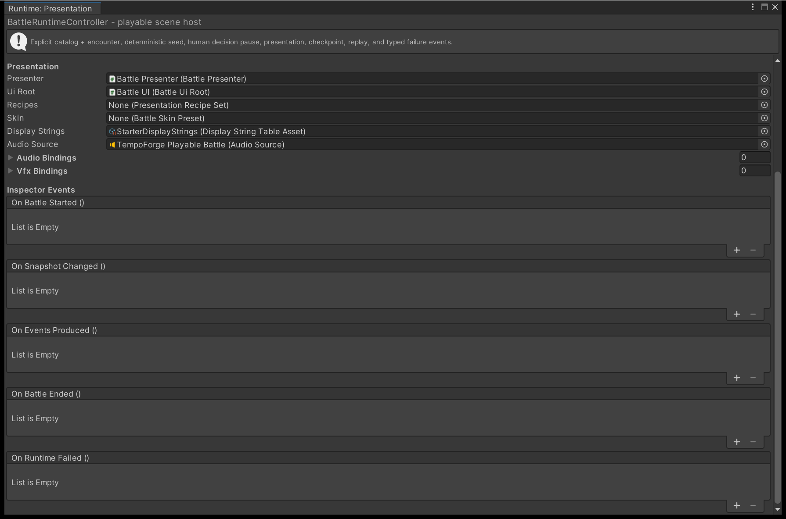

# 4. Draw the battle on screen

The battle you started in [guide 3](run-a-battle-from-code.md) runs with nothing on screen.
Binding a `BattlePresenter` to the same compiled content gives you the stage, the combatant
tokens and the battle interface, all fed from the events and snapshots you already have.

This is what the four steps below add up to:

{ .shot }

---

!!! note "The controller does all of this for you"
    `BattleRuntimeController` binds the presenter and the interface from Inspector fields, with
    no binding code at all. See [2. Put a battle in your scene](playable-battle-in-a-scene.md).
    Read on when your own driver owns the engine.

    { .shot }

## 1. Bind the presenter

A `BattlePresenter` holds no engine and cannot obtain one. It receives everything through one
explicit binding, handed to it once per battle.

```csharp
using TempoForge.Presentation;

var presenterHost = new GameObject("BattlePresenter");
var presenter = presenterHost.AddComponent<BattlePresenter>();

var log = new PresentationLog();
var pool = new BuiltInPoolAdapter(presenterHost.transform, log);

presenter.Bind(new PresenterBinding(
    compiled,                        // CompiledAuthoringCatalog
    encounter.FormationLayout,       // from the compiled encounter you started
    recipeSet,                       // PresentationRecipeSet
    new BuiltInAnimationAdapter(log),
    new BuiltInVfxAdapter(pool, log),
    new BuiltInAudioAdapter(audioSource, log),
    pool,
    labels,                          // DisplayStringTable
    uiRoot,                          // BattleUiRoot, optional
    log));                           // optional shared log
```

`Bind` creates a child object named `BattleStage2D` and spawns one token per occupied
formation slot in that encounter's layout. Every argument up to `labels` is required; a null
one throws rather than degrading quietly. The interface and the log are the only optional two.

Call `Teardown()` before binding a new battle. It returns every pooled instance and clears the
beat queue, and the presenter does the same when its object is destroyed.

### Tokens, recipes and labels

| Argument | Where it comes from | If you have nothing yet |
| --- | --- | --- |
| `recipeSet` | A `PresentationRecipeSet`. The shipped one is `Assets/TempoForge/Samples/StarterContent/Recipes/StarterRecipeSet.asset` | An event with no matching recipe becomes an instant beat with no visuals |
| `labels` | A `DisplayStringTable` of stable id to display name pairs | `DisplayStringTable.Empty` -- every lookup falls back to the raw id |
| Token art | A pool prototype registered under `BattleStage2D.TokenPoolKey` | The pool returns a bare object, so you get the skinned nameplate and bars over empty ground |

Register your token prototype before binding:

```csharp
pool.RegisterPrototype(BattleStage2D.TokenPoolKey, tokenPrototype);
```

!!! note
    Set `presenter.PlayerTeamId` to choose which side is tinted as allies. Left unset, the
    first team in the compiled layout is treated as the player's.

## 2. Forward events and snapshots

Three calls, in this order, after each `AdvanceTicks`:

```csharp
var step = engine.AdvanceTicks(ticks);

presenter.EnqueueEvents(step.Events);     // one beat per event
presenter.AdoptSnapshot(step.Snapshot);   // authoritative state, verbatim
presenter.Tick(Time.deltaTime);           // visual clock only
```

| Call | What it drives |
| --- | --- |
| `EnqueueEvents` | Derives one presentation beat per event, and appends a line to the feedback log when an interface is bound |
| `AdoptSnapshot` | Health, shields and status pips on the tokens, the roster, the turn-order strip, the skill tray, and the result banner once the result is terminal |
| `Tick` | Beat playback, bar and plate animation, and floating numbers |

Both `EnqueueEvents` and `AdoptSnapshot` throw if the presenter is not bound.

`Tick` is the only one that consumes real time, and it scales that time by `presenter.Speed`.
Speed 0 freezes the visuals, `SkipAll()` finishes every queued beat at once, and neither
touches a simulation value. That is why a battle watched at 4x ends the same way as one
watched paused and stepped.

!!! note
    A presenter queues up to 4096 beats and shows up to 128 floating numbers at once. Past
    those caps the oldest beat completes instantly, counted by `ForcedInstantBeatCount`, and
    the oldest number is retired to the pool. Nothing is dropped and nothing throws.

## 3. Frame the stage

A token sits at its projected viewport pixel multiplied by 0.01 world units. The presenter
starts on a 1920x1080 viewport at the screen origin, which spans 19.2 by 10.8 units from the
world origin -- the demo scene's camera is orthographic, size 5.4, at `(9.6, 5.4, -10)` for
exactly that reason.

Add **TempoForge > Battle Stage Frame** to the presenter's own object to derive the viewport
from the real screen instead:

| Field | Effect |
| --- | --- |
| **Mode** | `FixedAspect` keeps combatant spacing consistent across devices, `FullScreen` uses everything inside the margins, `Explicit` uses a pixel rectangle |
| **Margins** | Screen fractions reserved on each side so your own UI never overlaps the stage. The defaults reserve 12% at the top and 18% at the bottom |
| **Respect Safe Area** | Insets the stage into the device safe area as well as the margins |
| **Stage Scale** | Pulls the formation tighter or wider about its centre |

Changing any of them re-pushes the viewport and rebuilds the stage. None of it can change a
result.

## 4. Add the interface

Add a `BattleUiRoot` component to an empty object and pass it as the binding's interface
argument. It builds its own screen-space canvas, scaler and raycaster, and creates only the
regions the active skin marks visible.

- Leave **Skin Preset** empty and it draws with the shipped default skin rather than unstyled
  boxes. Tokens are dressed from the same skin, so stage and interface share one palette.
- Pass `null` for the interface instead and the presenter runs stage-only.
- Tick **Hide Transport Controls** for a shipping build. The scenario and playback controls
  are development tools.
- uGUI needs an `EventSystem` in the scene before any element receives pointer input. The
  wizard and the demo both create one; a scene you built by hand may not have one.

The interface offers legal choices and raises `CommandChosen`; it submits nothing itself. If
clicking a skill does nothing, start with
[Troubleshooting](../how-to/troubleshooting.md#clicking-a-skill-does-nothing).

## Next

- **[5. Take a decision from the player](take-player-input.md)** -- turn a tray choice into a
  submitted command.
- **[Turn events into visuals](../how-to/presentation-recipes.md)** -- author the recipe that
  gives an event its animation, effect and audio.
- **[Fit the battle to your screen](../how-to/interface-layout.md)** -- place each region and
  reserve space for your own UI.
