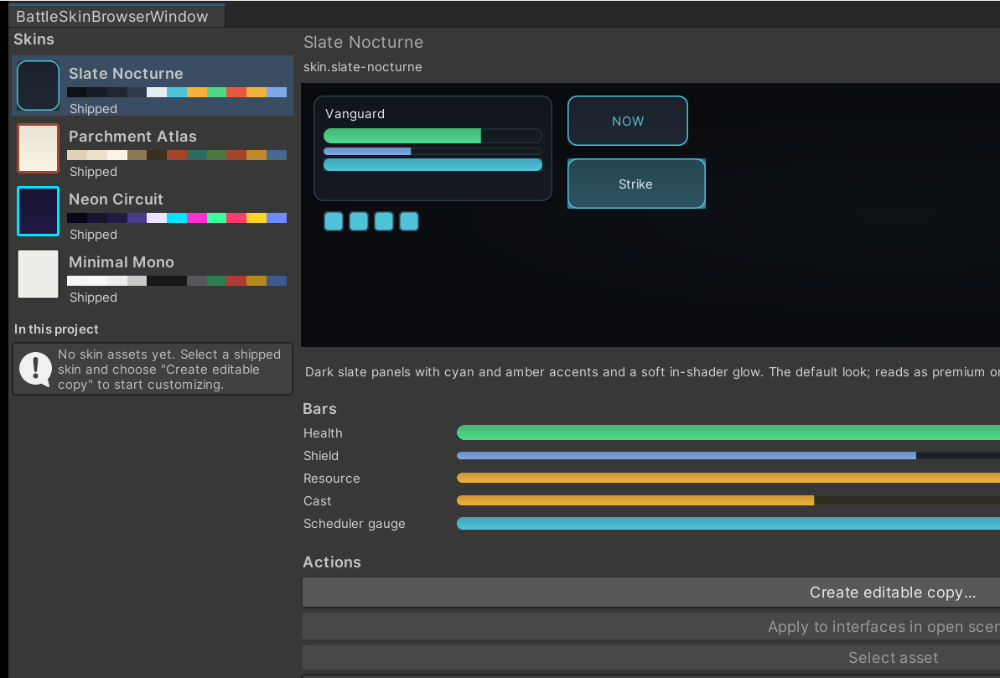

# 5. Restyle the interface

Everything the battle interface draws itself with lives in one asset. Here you turn a
shipped skin into an asset you own, assign it, and swap skins while a battle is running.

## The authoring loop

{ .shot }

1. **Tools ▸ TempoForge ▸ Skin Browser**. The four shipped skins are listed first; every
   `BattleSkinPreset` in the project follows under **In this project**.
2. Select one. The interface preview, the palette strip and the five bar samples are drawn
   with the same shader and the same material writer the runtime interface uses, so the
   preview cannot drift from what ships.
3. **Create editable copy…** and choose where to save. The file name becomes both the
   display name and the stable id, so `Night Slate` is saved as `skin.night-slate`.
4. Select the new asset. Its inspector opens with a **Live preview** foldout above the
   fields and recompiles the preview as you edit.
5. Assign the asset to the **Skin Preset** field on your `BattleUiRoot`, or press **Apply
   to interfaces in open scenes** in the browser to assign it to every interface root in
   the open scenes at once.

**Apply to interfaces in open scenes** and **Select asset** stay disabled while a shipped
skin is selected, because there is no asset behind it to assign or reveal.

!!! note "The id is the identity, not the file name"
    Renaming the asset is safe. Changing its **Stable Id** is not — that string is how the
    skin is identified, including by the browser when it reselects your skin after a
    reimport.

!!! tip "Starting from a blank asset"
    **Assets ▸ Create ▸ TempoForge ▸ Battle Skin Preset** creates an asset seeded with the
    Slate Nocturne values rather than empty fields. Out-of-range numbers are clamped when
    the asset compiles rather than rejected, so a half-edited skin still renders.

If the browser warns that the skinned-surface shader could not be loaded, previews fall
back to flat colours — see
[Troubleshooting ▸ the interface looks flat](../how-to/troubleshooting.md#the-interface-looks-flat).

## The four shipped skins

The same frame in each skin. Nothing but the skin differs between these four shots.

<div class="grid-2" markdown>

<figure markdown>
  { .shot }
  <figcaption><strong>Slate Nocturne</strong> &mdash; the default. Dark slate, cyan and amber accents, a soft in-shader glow.</figcaption>
</figure>

<figure markdown>
  { .shot }
  <figcaption><strong>Parchment Atlas</strong> &mdash; warm paper, heavier inked borders, sepia type, circular pips, no glow.</figcaption>
</figure>

<figure markdown>
  { .shot }
  <figcaption><strong>Neon Circuit</strong> &mdash; deep indigo, saturated cyan and magenta rims, the strongest halos, hexagonal pips.</figcaption>
</figure>

<figure markdown>
  { .shot }
  <figcaption><strong>Minimal Mono</strong> &mdash; light neutral surfaces, flat fills, no glow and no gradients. The neutral base.</figcaption>
</figure>

</div>

Every one of them is a starting point for **Create editable copy…**. Which fields you then
change is covered by [Palette and surfaces](../how-to/skin-surfaces.md) and
[Bars, gauges and pips](../how-to/skin-bars-and-pips.md).

## Why the shipped skins are code, not assets

The four looks are built by
[`BattleSkinDefaults`](../reference/skinning-and-appearance.md#battleskindefaults) in code.
That has four consequences worth knowing before you author your own.

- A `BattleUiRoot` with no preset assigned resolves to Slate Nocturne, so a scene you have
  not configured yet never renders as unstyled boxes.
- No font, texture or material is redistributed for a look. Every surface is drawn
  procedurally from numbers, and text falls back to Unity's built-in runtime font while
  the skin's **Font** field is empty.
- A shipped skin cannot be edited in place. Save your copy outside
  `Assets/TempoForge/`, and reimporting the package cannot touch your look.
- A skin is presentation-only. It never enters a snapshot, a replay, a state hash or a
  compiled catalog, so no skin change can alter a battle outcome. See
  [Determinism](../explanation/determinism.md).

## Apply a skin at runtime

```csharp
[SerializeField] private BattleUiRoot ui;
[SerializeField] private BattleSkinPreset nightSkin;

private void EnterNightMode()
{
    ui.ApplySkin(nightSkin);   // safe on a live battle
}
```

### What a swap rebuilds

`ApplySkin` stores the preset, destroys the region tree, reconfigures the canvas scaler
from the new layout tokens, rebuilds every region, then repaints the roster, timeline,
skill tray, feedback log and result banner from state the interface already holds. No
snapshot has to be replayed and no command is affected. Passing `null` returns the
interface to the shipped default.

!!! warning "Two things a swap does not carry across"
    - Anything you parented to `TransportMount` is destroyed with the region tree.
      Re-parent your own controls after the swap.
    - Token plates on the stage keep the skin they were dressed with.
      `BattlePresenter` reads `BattleUiRoot.Skin` when you call `Bind`, so re-bind the
      presenter and adopt the current snapshot again to re-dress the tokens. Floating
      numbers pick the new skin up on their next spawn.

### Read the resolved values

```csharp
CompiledBattleSkin skin = ui.Skin;                 // never null
Color accent = skin.Palette.Accent;
float healthBarHeight = skin.Bars.Health.Height;
```

[`ui.Skin`](../reference/interface-and-widgets.md#battleuiroot) resolves to the assigned
asset or to the shipped default, so code that reads a colour or a height needs no null
branch. Those same values are what you build panels of your own from.

## Next

- **[Palette and surfaces](../how-to/skin-surfaces.md)** — the colours, shapes, fills,
  glows and button states every panel is drawn from.
- **[Bars, gauges and pips](../how-to/skin-bars-and-pips.md)** — the five bar roles, the
  status pips, and the primitives for your own panels.
- **[Fit the battle to your screen](../how-to/interface-layout.md)** — move each region,
  reserve space for your own UI, and frame the stage.
